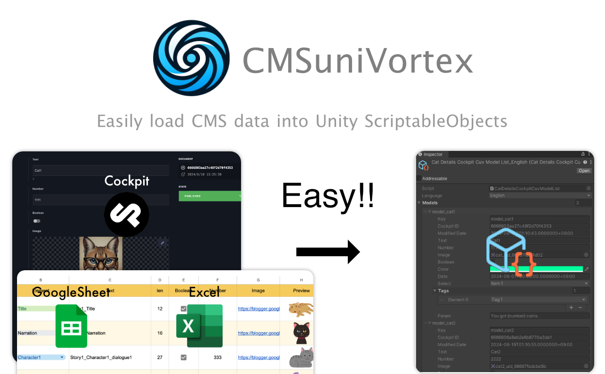
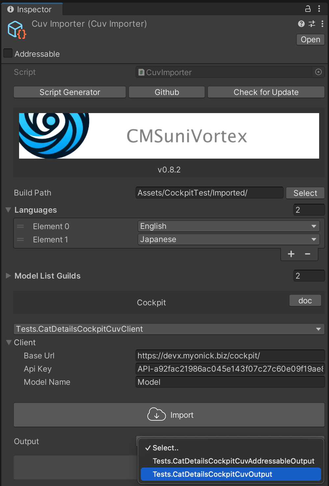
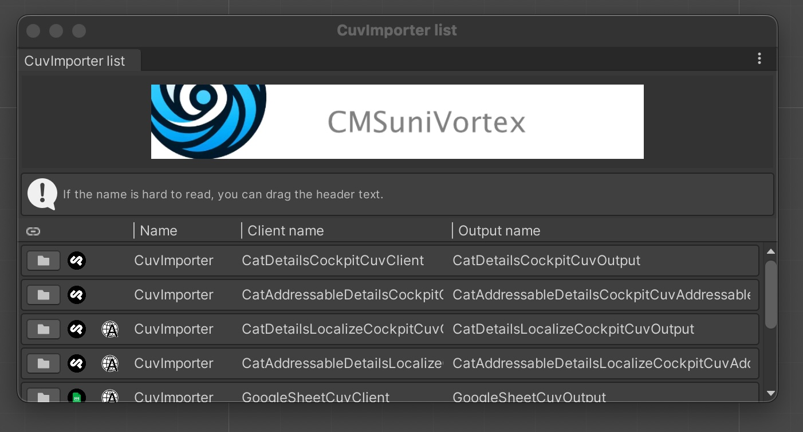

[日本語のRead me](docs/README_jp.md)


# CMSuniVortex
It's a plugin that allows you to easily load CMS data into `ScriptableObject`.



## Table of Contents

<!-- START doctoc generated TOC please keep comment here to allow auto update -->
<!-- DON'T EDIT THIS SECTION, INSTEAD RE-RUN doctoc TO UPDATE -->
<details>
<summary>Details</summary>

- [Why use this plugin?](#why-use-this-plugin)
  - [Ease of Input](#ease-of-input)
  - [High-performance Data](#high-performance-data)
- [Supported CMS](#supported-cms)
- [Methods of Reference Supported](#methods-of-reference-supported)
- [Getting started](#getting-started)
  - [Install via git URL](#install-via-git-url)
- [Quick Start](#quick-start)
  - [Generate CuvImporter](#generate-cuvimporter)
  - [Generating the code](#generating-the-code)
  - [Entering Necessary Information in CuvImporter](#entering-necessary-information-in-cuvimporter)
    - [Cockpit Client](#cockpit-client)
  - [Cockpit CMS Test](#cockpit-cms-test)
    - [Login Information](#login-information)
    - [Notes for Cockpit Test Server](#notes-for-cockpit-test-server)
  - [Starting the Import](#starting-the-import)
  - [Specifying the Output](#specifying-the-output)
  - [Retrieval and Display of Data](#retrieval-and-display-of-data)
- [Setup for Cockpit](#setup-for-cockpit)
- [Roles of Each Class](#roles-of-each-class)
- [CuvImporter list](#cuvimporter-list)
  - [Display Method](#display-method)
- [Why Do I Want to Make This Plugin?](#why-do-i-want-to-make-this-plugin)
  - [1. Addressable](#1-addressable)
    - [Advantages](#advantages)
    - [Concerns](#concerns)
  - [2. WebView](#2-webview)
    - [Merits](#merits)
    - [Concerns](#concerns-1)
  - [3. Json](#3-json)
    - [Merits](#merits-1)
    - [Concerns](#concerns-2)
  - [What We Learned From the Test Results](#what-we-learned-from-the-test-results)
    - [iOS : iPhone SE2 17.5.1](#ios--iphone-se2-1751)
    - [Android : Galaxy S10 Android11](#android--galaxy-s10-android11)
- [Plans for the Future](#plans-for-the-future)

</details>
<!-- END doctoc generated TOC please keep comment here to allow auto update -->

## Why use this plugin?

This plugin is built on the concept of being **"Easy to input and delivering top-notch performance"**.

### Ease of Input

When it comes to input, we think of CMS. CMS is filled with knowledge on **how to input data easily and without stress**. Also, it gives the ease of being able to be updated from anywhere.

### High-performance Data

`ScriptableObject` is a data format that is optimized for handling in Unity. It has excellent performance.

However, these two may seem unrelated at first glance. But it is CMSuniVortex that connects CMS and `ScriptableObject`. This is not a mere plugin, but a solution born out of pursuing efficiency and performance.

## Supported CMS – Client

- [Cockpit](docs/IntegrationWithCockpit.md)
- [Google Sheets](docs/IntegrationWithGoogleSheet.md)

## Methods of Reference Supported – Output

You can specify how to refer to the data you have output.

- Direct reference
- Referenced via [Addressables](https://docs.unity3d.com/Packages/com.unity.addressables@1.19/manual/index.html)

## Upgrading from 1.X to 2.X

> [!CAUTION]
> **2.X upgrade contains breaking changes. Please make sure to backup before upgrading.**

Specifically, we separated classes that use Languages (which was mandatory in 1.X) from those that don't. As a result,
previous Language settings have been cleared, so please reconfigure and re-import after setting them again.

<details><summary>Change Details</summary>

### Added ability to select Localization in Script Generator

We made the previously mandatory Language selection optional.

`Window > CMSuniVortex > open Script Generator`


### Changed Languages to Sheet Names in GoogleSheet

If you want to continue using Language as before, please select Use localization in the Script Generator and build.
※This will not affect existing classes.


### Key names can now be changed

The Key name required for data can now be modified.


For example, in GoogleSheet, you previously had to use "Key" as the column name for unique IDs, but this could be
unclear in some cases. Now you can change it to match your sheet.


### Component Changes and Additions

We renamed components used to get values from output data and added components for Localization.

- **CuvList**
- **CuvModel**
- **CuvLocalize**
- **CuvAddressableList**
- **CuvAddressableModel**
- **CuvLanguages**
- **CuvLanguageDropDown**
- **CuvLanguageSwitcher**

</details></summary>

## Getting started

### Install via git URL
Please add the URL to "Window > Package Manager > Add package from git URL...".

```
https://github.com/IShix-g/CMSuniVortex.git?path=Packages/CMSuniVortex
```


## Quick Start

### Generate CuvImporter

Right click on the Project and select "Create > CMSuniVortex > create CuvImporter" to create a `CuvImporter`.


### Generating the code

Click the "Script Generator" button on the generated `CuvImporter`.


Enter the necessary information to generate the code. In this case, we generate the code for Cockpit.


※ Classes that have been generated once will not be overwritten when generated again and will be ignored.

|                  | explanation                                              | e.g.                |
|------------------|----------------------------------------------------------|---------------------|
| Full Class Name  | Specify the class name. Namespace can also be specified. | namespace.ClassName |
| Build Path       | Specify the path of the directory to generate the code.  | Assets/Scripts/     |
| Use addressables | Should output code for using addressables?               |                     |
| Use localization | Should output code for localization?                     |                     |
| Generate output  | Should output code for output?                           |                     |

### Entering Necessary Information in CuvImporter

After generating, return to CuvImporter and enter the necessary information. Specify the script generated earlier as the client. This time, we selected `CatDetailsCockpitCuvClient` for direct reference. If using [Addressables](https://docs.unity3d.com/Packages/com.unity.addressables@1.19/manual/index.html), select the `AddressableClient` above it.

**Naming rule for output Client:** "Full class name specified when generating code" + "CMS name" + "Output name" + "CuvClient"

|            | explanation                                            | e.g.           |
|------------|--------------------------------------------------------|----------------|
| Build Path | Specify the directory where the data will be output.           | Assets/Models/ |
| Languages  | Specify the language, even if not used, at least one needs to be selected.    | English|
| Client     | Specify any client for direct reference or Addressables, etc.. | Test.ClassNameCockpitCuvClient|
| Output     | Decide how to refer to the data output by the client. | Test.ClassNameCockpitCuvOutput|


#### Cockpit Client

|            | explanation                                            | e.g.           |
|------------|--------------------------------------------------------|----------------|
| Base Url | URL where Cockpit is installed           | https://xxx.xxx.com/cockpit/ |
| Api Key  | Api Key obtainable from the Cockpit admin page    | English|
| Model Name      | Model name set on Cockpit's admin page | Model |

### Cockpit CMS Test
Actual tests using Cockpit CMS are possible. Please use the following.

|            | value                                        |
|------------|----------------------------------------------|
| Base Url   | [https://devx.myonick.biz/cockpit/](https://devx.myonick.biz/cockpit/)|
| Api Key    | API-a92fac21986ac045e143f07c27c60e09f19ae856 |
| Model Name | Model                                        |

#### Login Information

Although the permission is read-only, you can actually log in and view the admin page.

|     | value                                                                  |
|-----|------------------------------------------------------------------------|
| URL | [https://devx.myonick.biz/cockpit/](https://devx.myonick.biz/cockpit/) |
| ID  | guest                                                                  |
| PW  | guest                                                                  |

#### Notes for Cockpit Test Server

- Please use in moderation.
- Do not access too frequently.
- Do not perform consecutive imports.
- Although advertisements are displayed because I use a free rental server, I am not involved at all.
- Please note that we may stop without notice if we find inappropriate access.

### Starting the Import

After input, click Import, and the data is generated in the specified directory.


### Specifying the Output

Decide how to refer to the imported data. This time, we select `CatDetailsCockpitCuvOutput` for direct reference.



After selection, click on Output to generate it.


### Retrieval and Display of Data

Data can be retrieved using `GetList()` from the generated `CatDetailsCockpitCuvReference`. If you use the prepared `CuvLocalized`, you can retrieve it as follows.


The instance of Reference and the Key set on the inspector are passed, so you use `TryGetByKey` to retrieve it.

**CuvLocalizedTest.cs**
```csharp
using CMSuniVortex;

public abstract class CuvLocalizedTest : CuvLocalized<CatDetailsLocalizeCockpitCuvReference>
{
    protected abstract void OnChangeLanguage(CatDetailsLocalize catDetails);
    
    protected override void OnChangeLanguage(CatDetailsLocalizeCockpitCuvReference reference, string key)
    {
        if (reference.TryGetByKey(key, out var model))
        {
            OnChangeLanguage(model);
        }
    }
}
```

**CuvLocalizedTextTest.cs**
```csharp
using UnityEngine;
using UnityEngine.UI;

[RequireComponent(typeof(Text))]
public sealed class CuvLocalizedTextTest : CuvLocalizedTest
{
    [SerializeField] Text _text;

    protected override void OnChangeLanguage(CatDetailsLocalize model)
    {
        _text.text = model.Text;
    }
    
    protected override void Reset()
    {
        base.Reset();
        _text = GetComponent<Text>();
    }
}
```

※ `CuvAddressableLocalized` is used for Addressables.

## Setup for Cockpit

For details on how to set up, please see [here](docs/IntegrationWithCockpit.md).

## Roles of Each Class

You can check representative classes that constitute the plugin [here](docs/RelationshipsBetweenClasses.md).

## CuvImporter list

You can check a list of created CuvImporters.



### Display Method
Window > CMSuniVortex > open CuvImporter list


## Localization

For information about localization, please refer to [here](docs/Localization.md).

## Why Do I Want to Make This Plugin?

What prompted me to develop this plugin was performance testing. There are roughly three methods to download data and display it.

### 1. Addressable

#### Advantages

Good performance with no need for deserialization or data conversion by using `ScriptableObject` or `Sprite`

#### Concerns

Since it needs to be exported by Unity, a programmer is required. Or a significant conversion system needs to be established.

<details><summary>Test Code</summary>


```csharp

using UnityEngine;
using UnityEngine.UI;
using UnityEngine.AddressableAssets;
using UnityEngine.ResourceManagement.AsyncOperations;
using UnityEngine.Profiling;

public sealed class AddressableTest : MonoBehaviour
{
    [SerializeField] Image _image;
    [SerializeField] Text _text;
    [SerializeField] Button _loadButton;
    [SerializeField] Button _unloadButton;

    AsyncOperationHandle<AddressableData> _handle;
    
    void Start()
    {
        _loadButton.onClick.AddListener(OnLoadButtonClicked);
        _unloadButton.onClick.AddListener(OnUnloadButtonClicked);
        _loadButton.interactable = true;
        _unloadButton.interactable = false;
    }

    void OnDestroy() => Unload();

    async void OnLoadButtonClicked()
    {
        _loadButton.interactable = false;
        _unloadButton.interactable = true;
        
        Profiler.BeginSample("AddressableTestProfile1");
        _handle = Addressables.LoadAssetAsync<AddressableData>("AddressableData");
        Profiler.EndSample();
        await _handle.Task;
        
        Profiler.BeginSample("AddressableTestProfile2");
        var obj = _handle.Result;
        _image.sprite = obj.Image;
        _text.text = obj.GetText();
        Profiler.EndSample();
    }

    void OnUnloadButtonClicked()
    {
        Unload();
        _loadButton.interactable = true;
        _unloadButton.interactable = false;
    }

    void Unload()
    {
        if (_image != default)
        {
            _image.sprite = default;
        }
        if (_text != default)
        {
            _text.text = default;
        }
        
        if (_handle.IsValid())
        {
            Addressables.Release(_handle);
        }
    }
}

[CreateAssetMenu(fileName = "AddressableData", menuName = "ScriptableObject/AddressableData", order = 0)]
public sealed class AddressableData : ScriptableObject
{
    public int ID;
    public string Title;
    public string Contents;
    public Sprite Image;

    public string GetText() => "ID:" + ID + "\nTitle:" + Title + "\nContents:" + Contents;
}
```

</details>


### 2. WebView

Webview from [Cross Platform Essential Kit](https://assetstore.unity.com/packages/tools/integration/cross-platform-native-plugins-essential-kit-mobile-ios-android-140111)

#### Merits

- Can be used for both WEB pages and applications.
- The layout can be free even after release.

#### Concerns

- Concerned about the amount of memory used.

<details><summary>Test Code</summary>

```csharp

using UnityEngine;
using UnityEngine.UI;
using UnityEngine.Profiling;
using VoxelBusters.CoreLibrary;
using VoxelBusters.EssentialKit;

public sealed class WebViewTest : MonoBehaviour
{
    const string url = "https://xxx.xxxx.com/webview/";
    
    [SerializeField] Button _openButton;
    [SerializeField] Button _closeButton;

    WebView _webView;

    void Start()
    {
        _openButton.onClick.AddListener(ClickOpenButton);
        _closeButton.onClick.AddListener(ClickCloseButton);
        _openButton.interactable = true;
        _closeButton.interactable = false;
    }

    void OnEnable()
    {
        WebView.OnShow += OnWebViewShow;
        WebView.OnHide += OnWebViewHide;
    }
    
    void OnDisable()
    {
        WebView.OnShow -= OnWebViewShow;
        WebView.OnHide -= OnWebViewHide;
    }
    
    void ClickOpenButton()
    {
        _openButton.interactable = false;
        
        Profiler.BeginSample("WebViewTestProfile");
        _webView = WebView.CreateInstance();
        _webView.SetNormalizedFrame(new Rect(0.1f, 0.2f, 0.8f, 0.6f));
        _webView.LoadURL(URLString.URLWithPath(url));
        _webView.Show();
        Profiler.EndSample();
    }
    
    void ClickCloseButton() => _webView.Hide();
    
    void OnWebViewShow(WebView view) => _closeButton.interactable = true;

    void OnWebViewHide(WebView view)
    {
        _openButton.interactable = true;
        _closeButton.interactable = false;
    }
}
```

Webページ
```html
<!DOCTYPE html>
<html lang="ja">
<head>
    <meta charset="utf-8">
    <title>Test</title>
    <meta name="viewport" content="width=device-width,initial-scale=1.0">
    <meta name="format-detection" content="telephone=no,email=no,address=no">
    <style type="text/css">
        img{
            max-width: 100%;
        }
    </style>
</head>
<body>

<div id="myData">
    <h2 id="title"></h2>
    <p id="contents"></p>
    
</div>

<script src="https://code.jquery.com/jquery-1.12.4.min.js"></script>

<script>
    $.ajax({
        url: 'getModel.php',
        dataType: 'json',
        success: function(data) {
            $('#title').text(data.Title);
            $('#contents').text(data.Contents);
            $('#image').attr('src', data.Image);
        },
        error: function (request, status, error) {
            console.log("Error: Could not fetch data");
        }
    });
</script>
</body>
</html>
```

データを取得するAPI
```php
<?php

class Model {
    public $Id;
    public $Title;
    public $Contents;
    public $Image;
}

mb_language("uni");
mb_internal_encoding("UTF-8");
header('Content-type: application/json');

$model = new Model();
$model->Id = 2222;
$model->Title = '猫　ねこ';
$model->Contents = '猫は、古代のミアキスと言う豹のような大きな動物が起源と言われています。 今から４０００～５０００年前にエジプトから発生し、住み良い環境を求め分化して中東に行きました。';
$model->Image = 'https://xxx.xxxx.com/webview/cat.jpg';
echo json_encode( $model );
```

</details>


### 3. Json

Display by converting JSON obtained from the server using [UnityWebRequest](https://docs.unity3d.com/ja/2021.3/ScriptReference/Networking.UnityWebRequest.html).

#### Merits
- Can be used for WEB and apps.
- Apart from initialization, it seems lighter than WebView.

#### Concerns
- There is a concern about the initialization cost if there are many images (only one image in the test).
- If you don't cache data, you need to provide your own caching mechanism.

<details><summary>Test Code</summary>

```csharp

using System;
using System.Collections;
using UnityEngine;
using UnityEngine.UI;
using UnityEngine.Networking;
using UnityEngine.Profiling;

public sealed class JsonTest : MonoBehaviour
{
    const string apiUrl = "https://xxx.xxxx.com/webview/getModel.php";
    
    [SerializeField] Image _image;
    [SerializeField] Text _text;
    [SerializeField] Button _loadButton;
    [SerializeField] Button _unloadButton;
    
    [Serializable]
    sealed class Model
    {
        public int ID;
        public string Title;
        public string Contents;
        public string Image;
        
        public string GetText() => "ID:" + ID + "\nTitle:" + Title + "\nContents:" + Contents;
    }

    void Start()
    {
        _loadButton.onClick.AddListener(OnLoadButtonClicked);
        _unloadButton.onClick.AddListener(OnUnloadButtonClicked);
        _loadButton.interactable = true;
        _unloadButton.interactable = false;
    }

    void OnDestroy() => Unload();
        
    void OnLoadButtonClicked()
    {
        _loadButton.interactable = false;
        _unloadButton.interactable = false;
        
        StartCoroutine(LoadCo((model, sprite) =>
        {
            _text.text = model.GetText();
            _image.sprite = sprite;
            Profiler.EndSample();
            _unloadButton.interactable = true;
        }));
    }
    
    IEnumerator LoadCo(Action<Model, Sprite> onSuccess)
    {
        Profiler.BeginSample("JsonTestProfile1");
        using var request = UnityWebRequest.Get(apiUrl);
        Profiler.EndSample();
        yield return request.SendWebRequest();
        
        if (request.result == UnityWebRequest.Result.Success)
        {
            Profiler.BeginSample("JsonTestProfile2");
            var model = JsonUtility.FromJson<Model>(request.downloadHandler.text);
            using var imgRequest = UnityWebRequestTexture.GetTexture(model.Image);
            Profiler.EndSample();
            yield return imgRequest.SendWebRequest();
            
            if (imgRequest.result == UnityWebRequest.Result.Success)
            {
                Profiler.BeginSample("JsonTestProfile3");
                var texture = ((DownloadHandlerTexture)imgRequest.downloadHandler).texture;
                var sprite = Sprite.Create(
                    texture, 
                    new Rect(0, 0, texture.width, texture.height), 
                    new Vector2(0.5f, 0.5f));
                
                onSuccess?.Invoke(model, sprite);
            }
            else
            {
                Debug.LogError(imgRequest.error);
            }
        }
        else
        {
            Debug.LogError(request.error);
        }
    }
    
    void OnUnloadButtonClicked()
    {
        Unload();
        _loadButton.interactable = true;
        _unloadButton.interactable = false;
    }

    void Unload()
    {
        if (_image != default
            && _image.sprite != default)
        {
            var tex = _image.sprite.texture;
            _image.sprite = null;
            DestroyImmediate(tex);
            Resources.UnloadUnusedAssets();
        }
        if (_text != default)
        {
            _text.text = default;
        }
    }
}
```

</details>

### What We Learned From the Test Results

From these tests, we learned that:

- Addressable performs the best.
- WebView uses significant memory on Android. It might not be possible to fully release all memory.
- Json has a significant initialization cost when there are many images.

From these results, I wanted to use Addressable, which has the best performance, but also allows for easy updates from the CMS, so I developed this plugin.

#### iOS : iPhone SE2 17.5.1

|  | GC Alloc | Time | Size |
|---|:--|:--|---|
| Addressables | 3.2KB | 0.24ms | 1.1MB |
| WebView | 22.9KB | 0.52ms | 2MB |
| Json | 15KB | 3.75ms | 2.3MB |

#### Android : Galaxy S10 Android11

|  | GC Alloc | Time | Size |
|---|:--|:--|---|
| Addressables | 3.1KB | 0.24ms | 9MB |
| WebView | 31.8KB | 0.56ms | 70MB |
| Json | 4.3KB | 1.18ms | 9.7MB |

## Plans for the Future

Currently, the system only supports up to the generation of `ScriptableObject`. However, we are planning to enhance it to handle the locally generated objects and to build Addressable to send to a server. We would also like to increase support for CMS. If you are interested, we appreciate your cooperation.