[日本語](InitialSetupOfGoogleSheet_jp.md)

# Initial setup for Google Sheets

## Setting process

- Create a project in [Google Cloud](https://console.cloud.google.com/)
- Enable Google Sheets API / Google Drive API
- Create a service account
- Create a service account key
- Share the spreadsheet

## Create a project in Google Cloud

Open [Google Cloud](https://console.cloud.google.com/) and click on the red frame

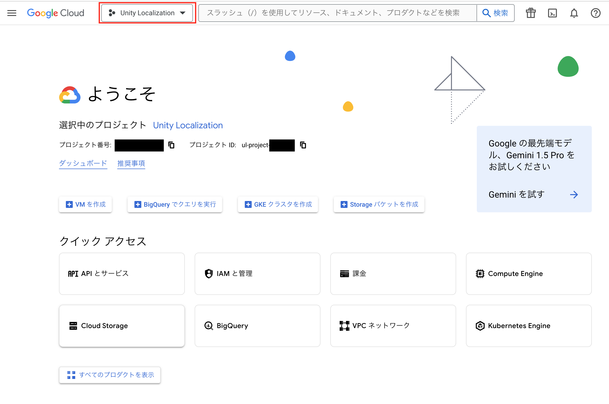

Create a new project.

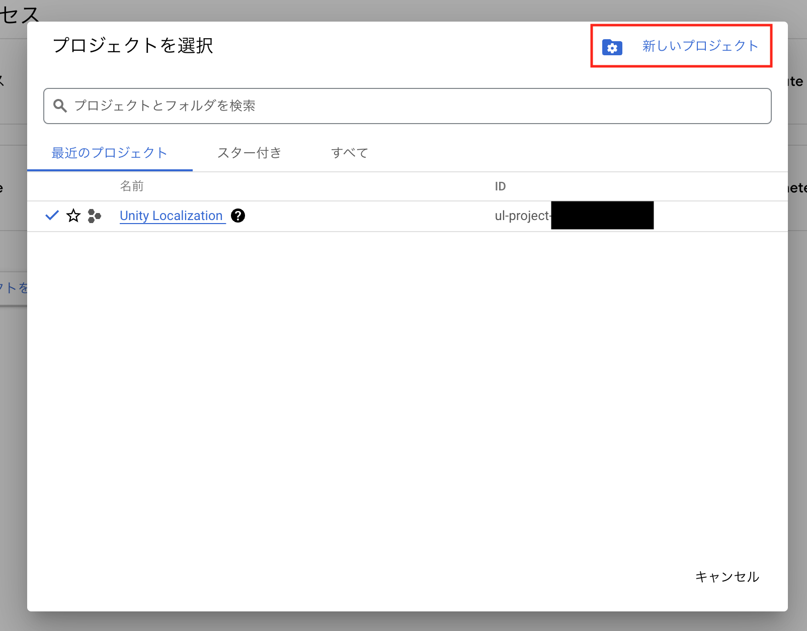

Click on "APIs & Services".

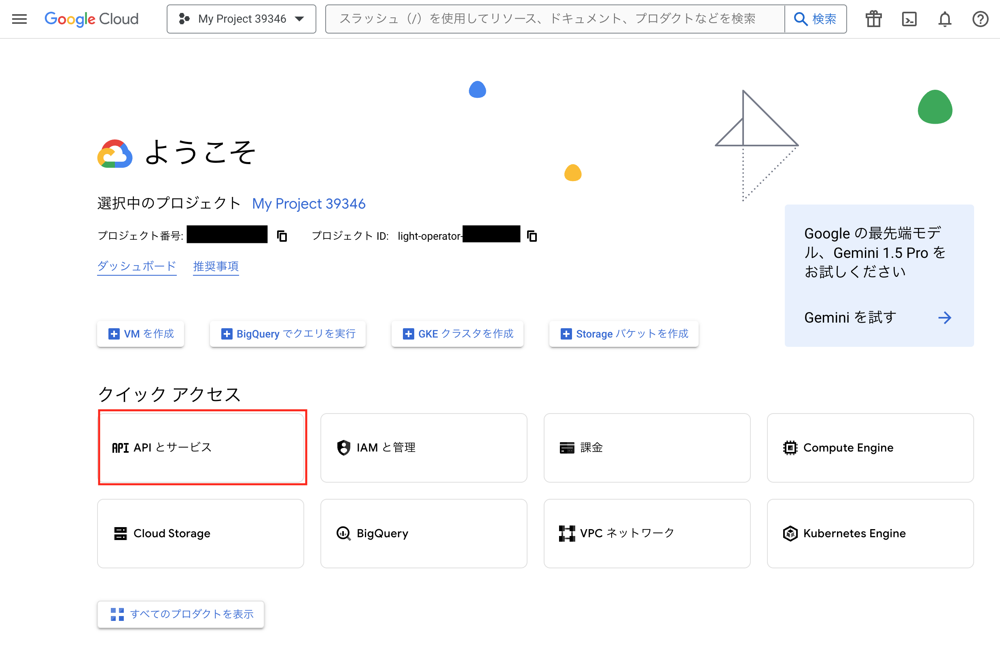

## Enable the API

You need to enable two APIs.

- Google Sheets API
- Google Drive API

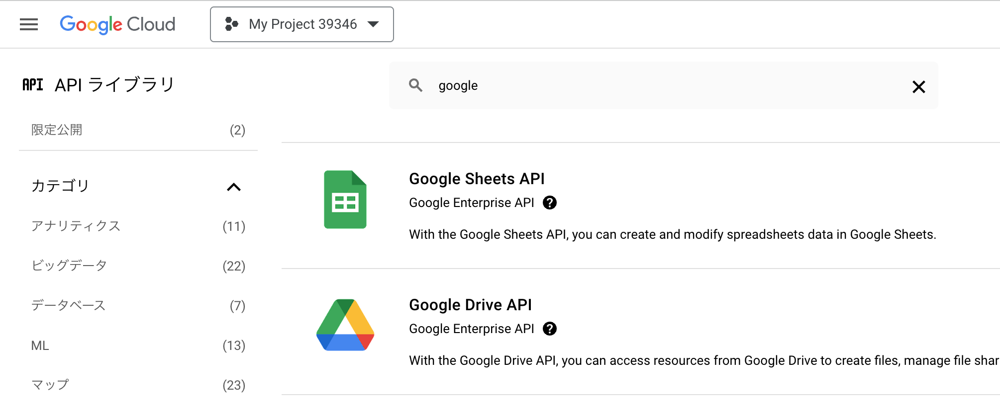

## Create a Service Account

Go to Settings > IAM & Admin > Service Accounts

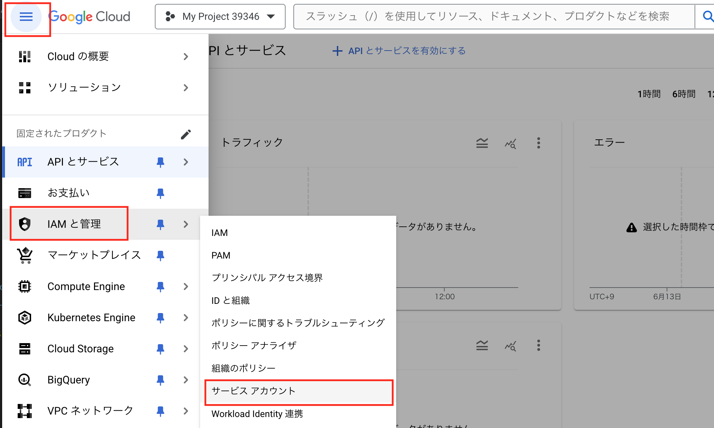

Create a new service account.

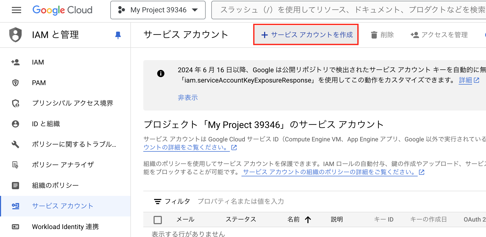

Enter the name and ID.

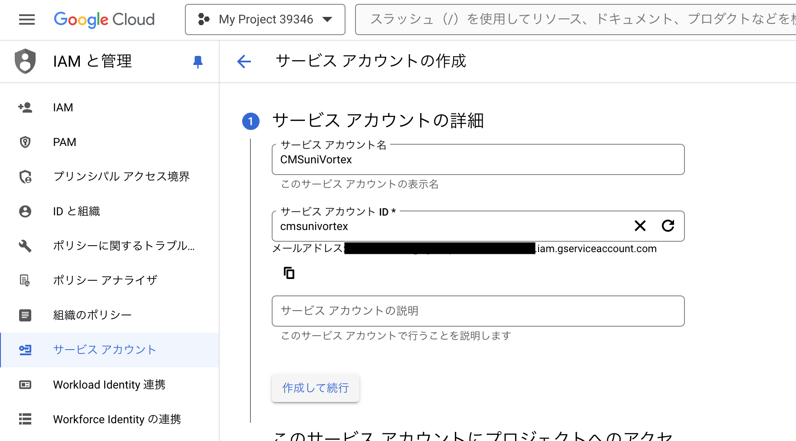

Select "Viewer" for the role.

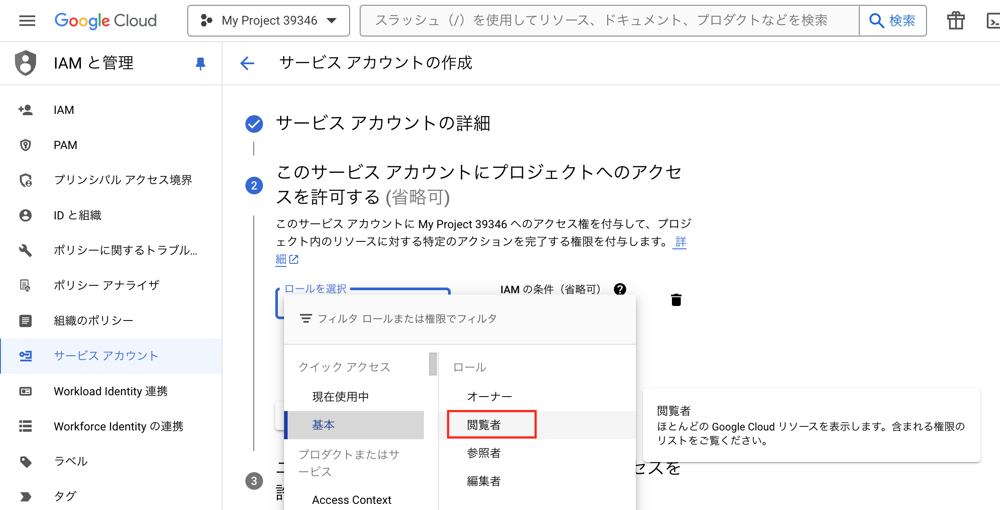

## Create a Service Account Key

Click on the service account you've created. The generated email address will be used later for Drive settings.

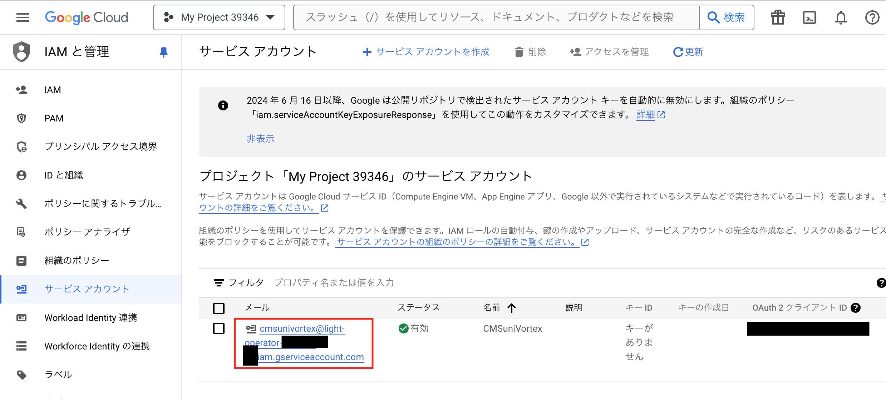

Create a new key.

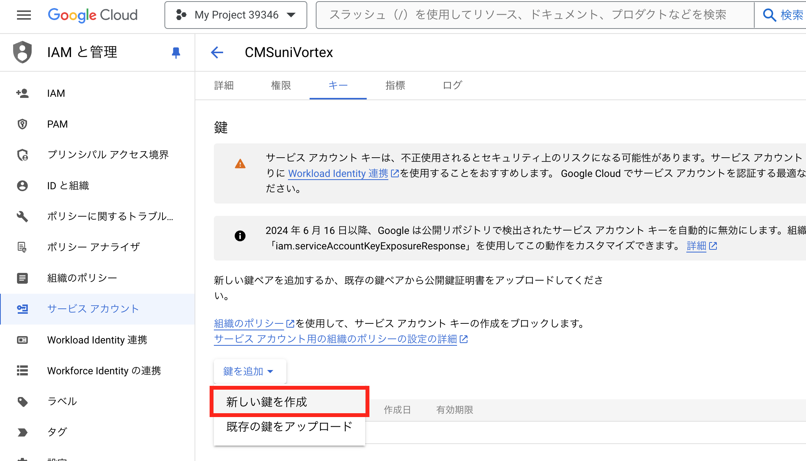

Save the key as JSON type and place it in a suitable location in Unity.
Please also note to not include this file in version control.

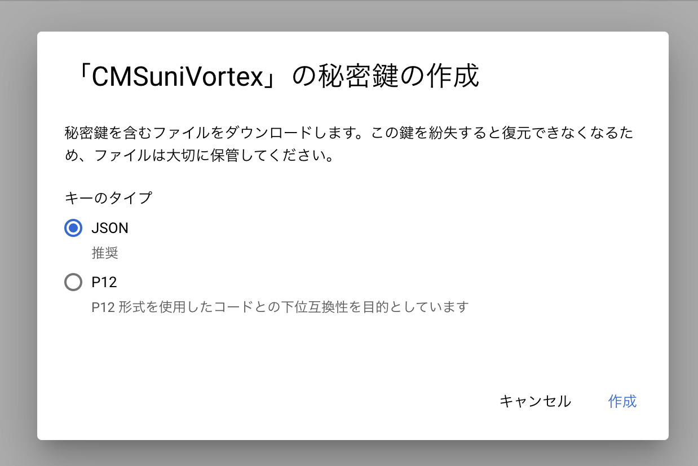

## Share spreadsheet

Go to [Google Drive](https://drive.google.com/drive/home), and create a spreadsheet for import if you don't have one. Open the file sharing settings.

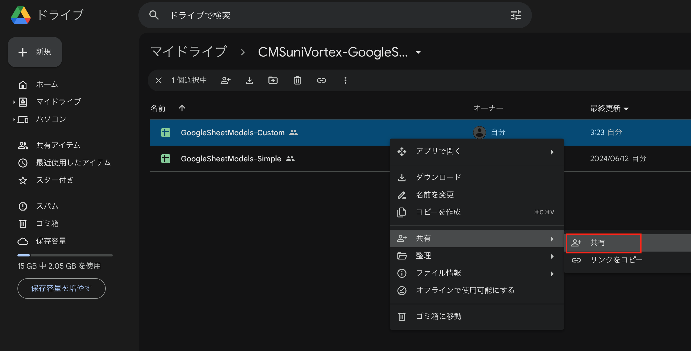

Add the email address of the service account from "Add users". Select "Viewer" as the role. This time, we set the role for the spreadsheet, but it is also possible to set it for the folder and allow all items under the folder.

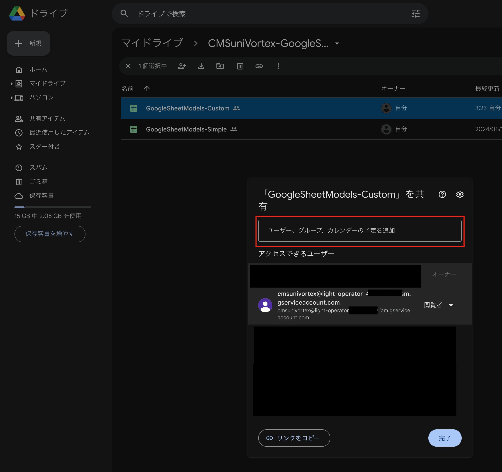

That completes the setup.

## Managing the Service Account Key

**Never publish the json file externally.** Of course, don't upload it to GitHub.
If you're developing with multiple people, designate someone in charge of imports or send it to them in a safe manner.
Ideally, each person should log into Google Cloud and generate a service account key.