[日本語](IntegrationWithCockpit_jp.md)

## Essential Environment for Cockpit

- Server where PHP can be used
- SQLite or MongoDB

For more details, please check [Requirements](https://getcockpit.com/documentation/core/quickstart/requirements).

If you want to use it locally, you can install it on [Xampp](https://www.apachefriends.org/).

## Cockpit Installation

Download and install the free version from [Cockpit](https://getcockpit.com/start-journey). Details of the installation will be omitted.

## Content Settings

Set up the Collection. The Name you set will be used later on the Unity side.

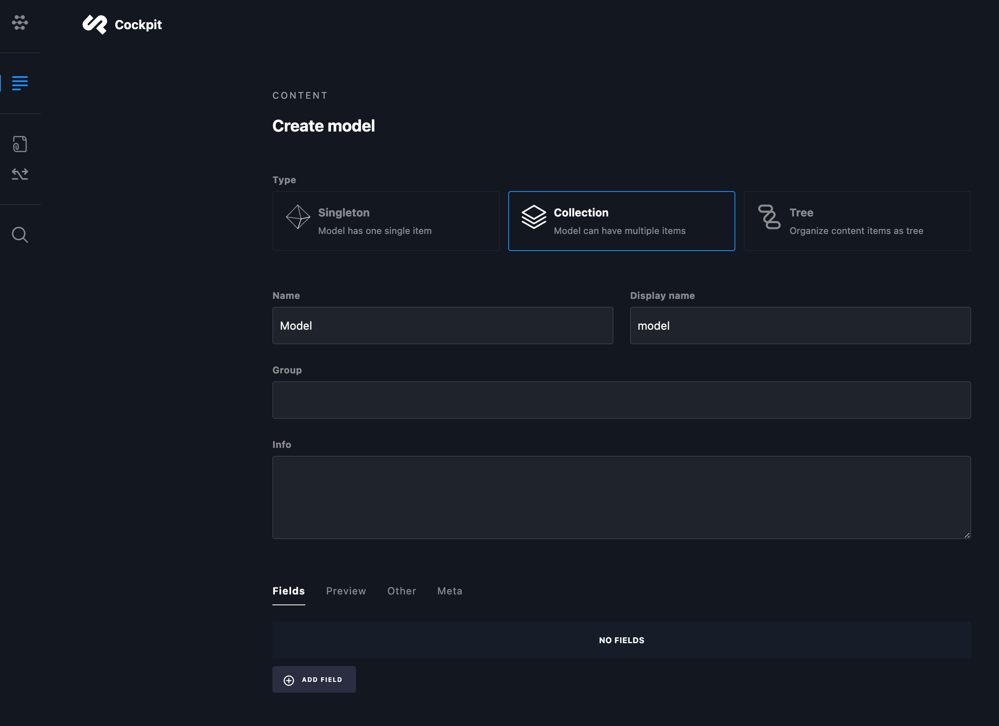

### Add Field

Click "ADD FIELD".

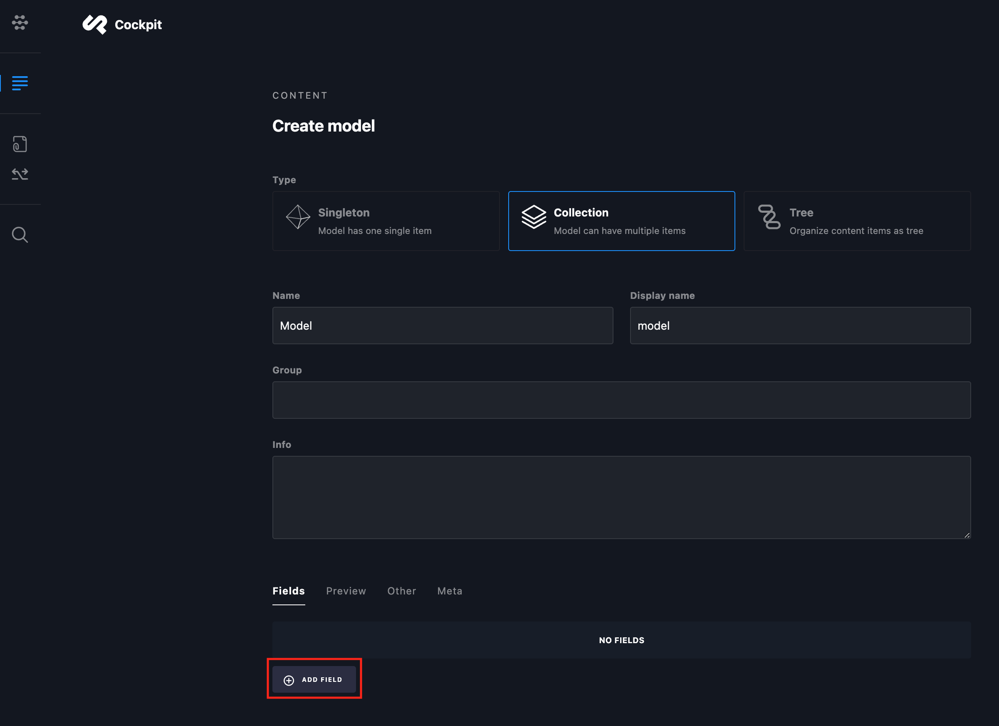

### Values to Always Set

Be sure to set the `Key` field for Text. While the Display Name can be any value, you must specify `key` for the Name.
This Key will be used to retrieve data in Unity.

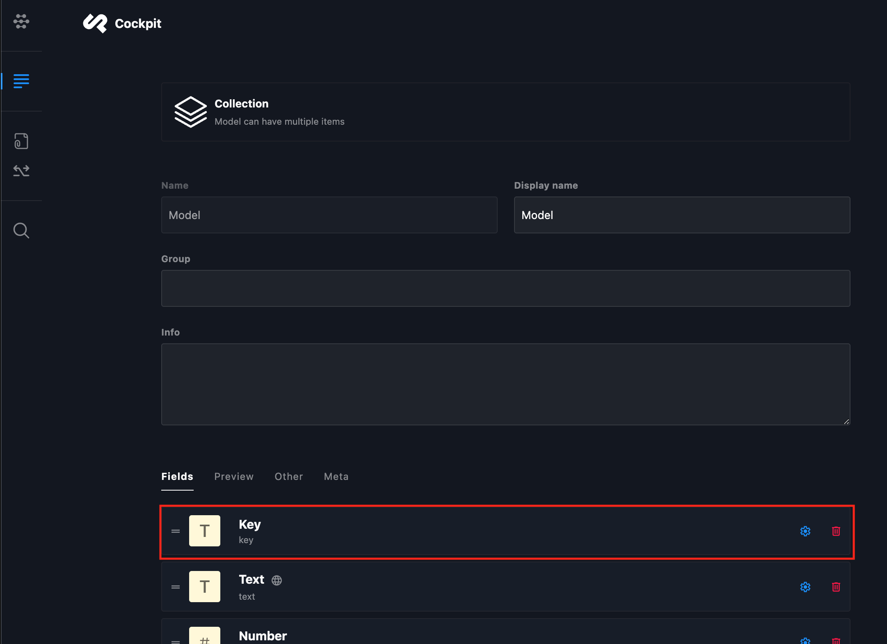

### Text

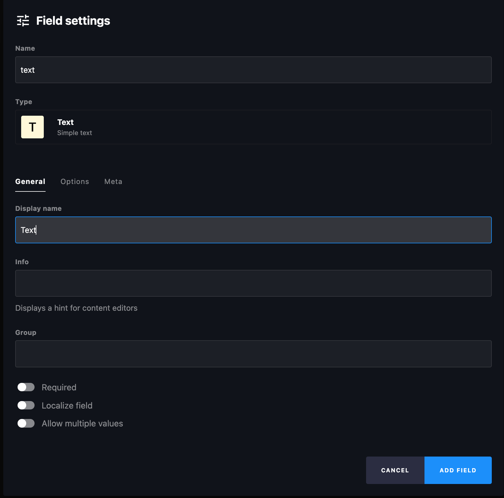

The added items can be retrieved on Unity with the ID as the Name.

```csharp
[Serializable]
public sealed class TestCockpitModel : CockpitModel
{
    public string Text;

    protected override void OnDeserialize()
    {
        Text = GetString("text");
    }
}
```

### Select

You can add constants from Options in Select and Tag.

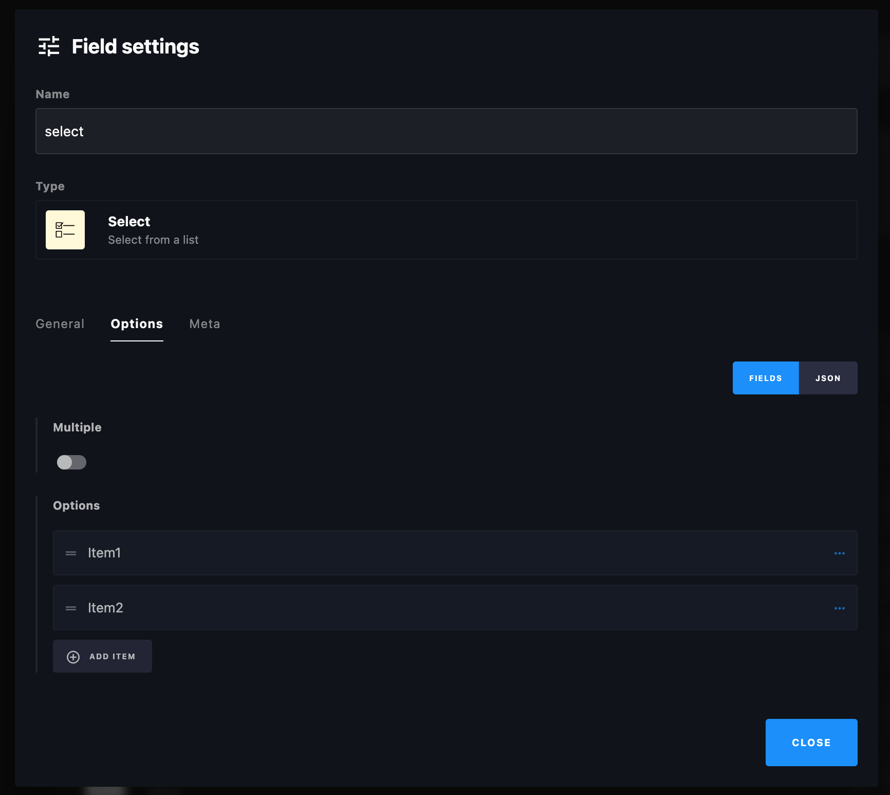

It's easy to use when converted to `enum`.

```csharp
[Serializable]
public sealed class TestCockpitModel : CockpitModel
{
    public ItemType Select;

    public enum ItemType { Item1, Item2, Item3 }

    protected override void OnDeserialize()
    {
        Select = GetSelect<ItemType>("select");
    }
}
```

### List

In addition to the following, there are multiple acquisition methods such as `GetStrings(key)`.

```csharp
using System;
using CMSuniVortex.Cockpit;
using UnityEngine;

namespace CMSuniVortex.Tests
{
    [Serializable]
    public sealed class TestCockpitModel : CockpitModel
    {
        public string Text;
        public long Number;
        public Sprite Image;
        public bool Boolean;
        public Color Color;
        public string Date;
        public ItemType Select;
        public TagType[] Tags;

        public enum TagType { Tag1, Tag2, Tag3 }

        public enum ItemType { Item1, Item2, Item3 }

        protected override void OnDeserialize()
        {
            Text = GetString("text");
            Number = GetLong("number");
            Boolean = GetBool("boolean");
            Color = GetColor("color");
            Date = GetDate("date");
            Select = GetSelect<ItemType>("select");
            Tags = GetTag<TagType>("tags");
            LoadSprite("image", asset => Image = asset);
        }
    }
}
```

If you've selected the Addressable-compatible CuvClient, you can use AssetReference.

```csharp
using System;
using CMSuniVortex.Cockpit;
using UnityEngine.AddressableAssets;

[Serializable]
public sealed class CatAddressableDetails : CockpitModel
{
    public AssetReferenceSprite Sprite;
    public AssetReferenceTexture2D Texture;

    protected override void OnDeserialize()
    {
        LoadSpriteReference("image", asset => Sprite = asset);
        LoadTextureReference("image2", asset => Texture = asset);
    }
}
```

### Input of Item

After saving the Field, enter multiple Items arbitrarily as we will conduct a retrieval test.

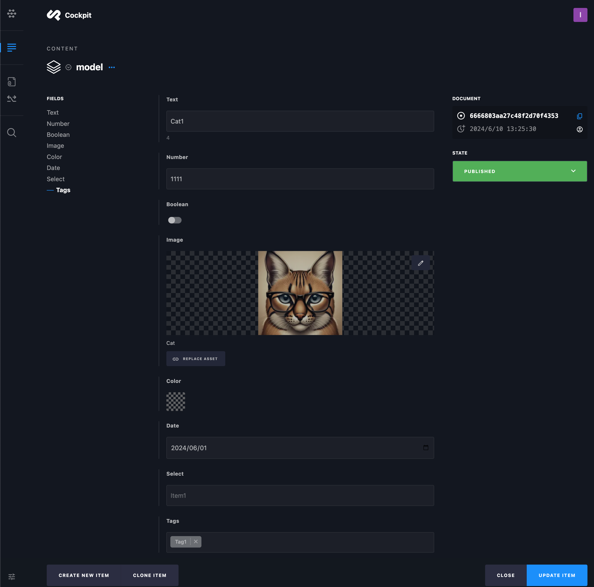

### Roles

After inputting the Item, set the Roles so that it can be retrieved from the outside.
Click the settings mark at the bottom left

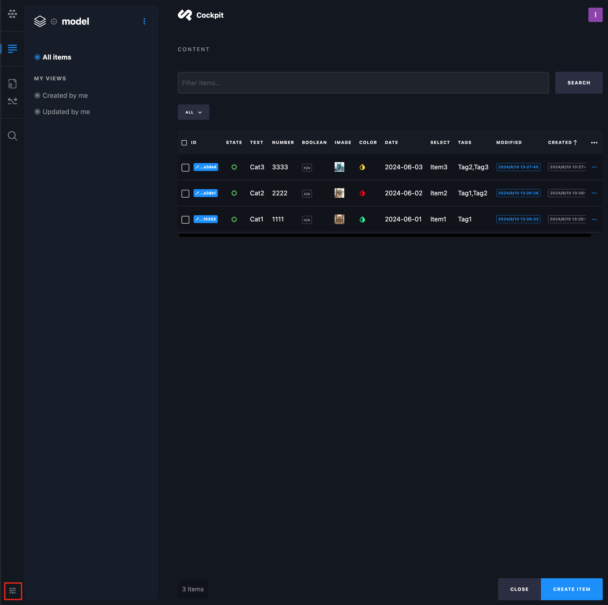

Click ROLES & PERMISSIONS

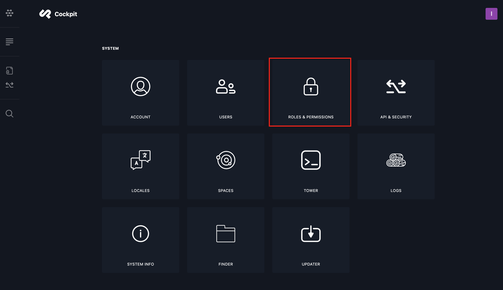

From "ADD ROLE" at the bottom right, select only Read of the CONTENT's Items created earlier and create it with "CREATE ROLE".

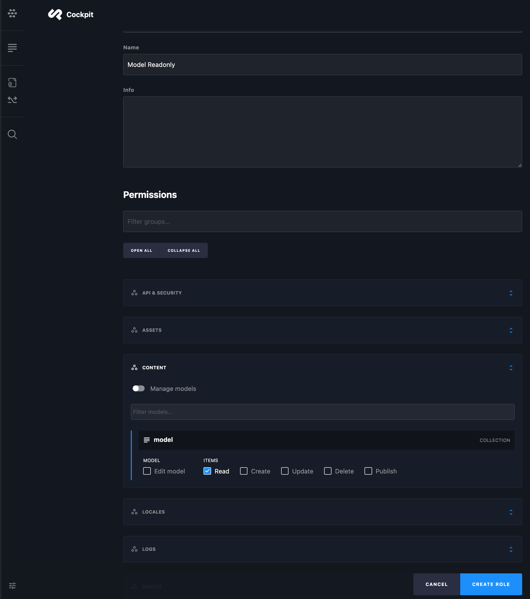

Click Api in the left menu and specify the Role you created earlier. The place to select is hard to understand. Please click the position where the dropdown is displayed in the image.

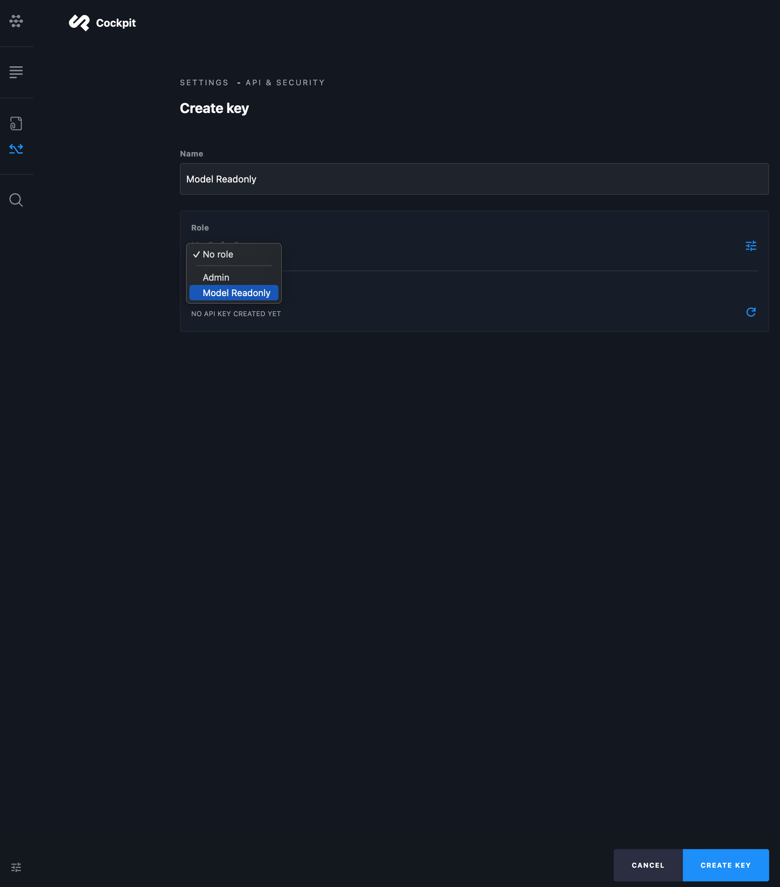

After setting, it will look like the following. Click "REST" to check if it works correctly.

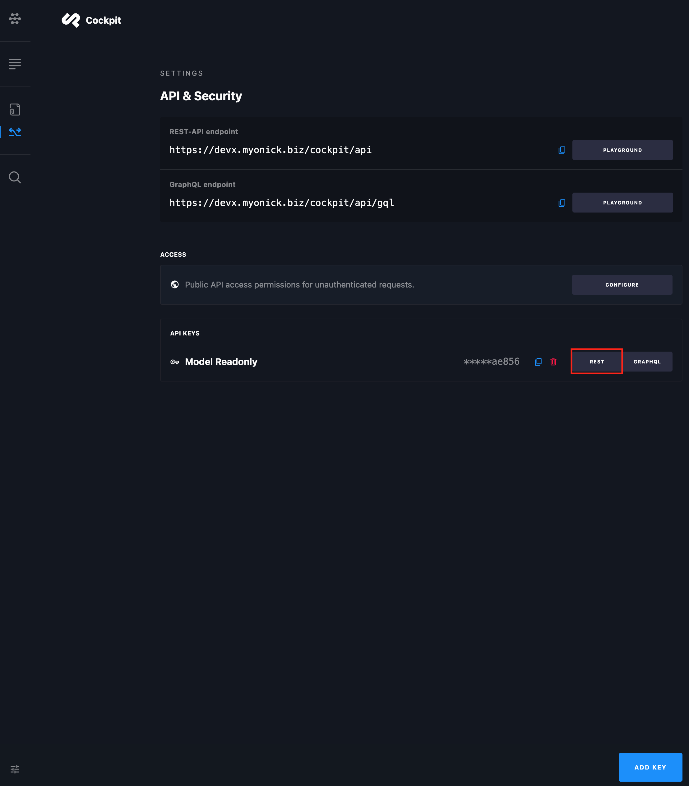

Perform a GET /content/items/{model} test. Check here to make sure you can retrieve it without problems. If something is wrong, remember to first perform this test.

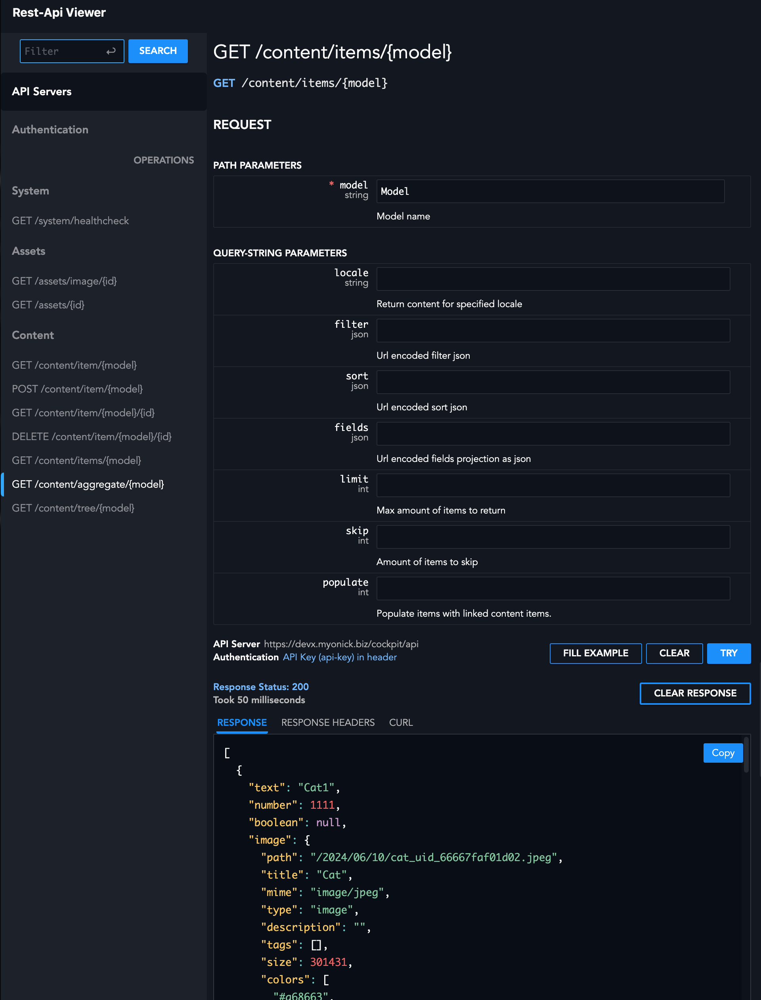

### Import

Move to Unity and enter the required information of `CuvImporter`, then click the Import button. If it can be retrieved, it is completed. For detail settings on the Unity side, please see [Readme](../README.md).

|            | Explanation                                 | e.g.                          |
|------------|---------------------------------------------|-------------------------------|
| Build Path | Path to generate assets                     | Assets/Generated/ |
| Base Url   | URL of Cockpit                              | https://ishix.happy.nu/cockpit/ |
| Api Key    | Api Key set in [Roles](#Roles)              | API-7fdae6291261ab7a958f4cf915ef0ce4dada8604 | 
| Model Name | Name set in [Cockpit Installation](#cockpit-installation) | Model |
| Languages  | Specify a language, even if you don't use it, you must select at least one.     | English |
| UseI18nCode | Check this if Cockpit language is configured with internationalization (i18n) codes |                                |


## Setting Up Languages

Select "LOCALES" from the settings mark at the bottom left.

> [!IMPORTANT] v2.2.0+
> Internationalization (i18n) is now available for languages. When configuring, please use 2-character
> codes. ([Internal codes](https://github.com/IShix-g/CMSuniVortex/blob/0174ea73a397af467937c3c33ffa522eb25412ca/Packages/CMSuniVortex/Runtime/Clients/Cockpit/CockpitCuvLocalizedClient.cs#L36-L83))

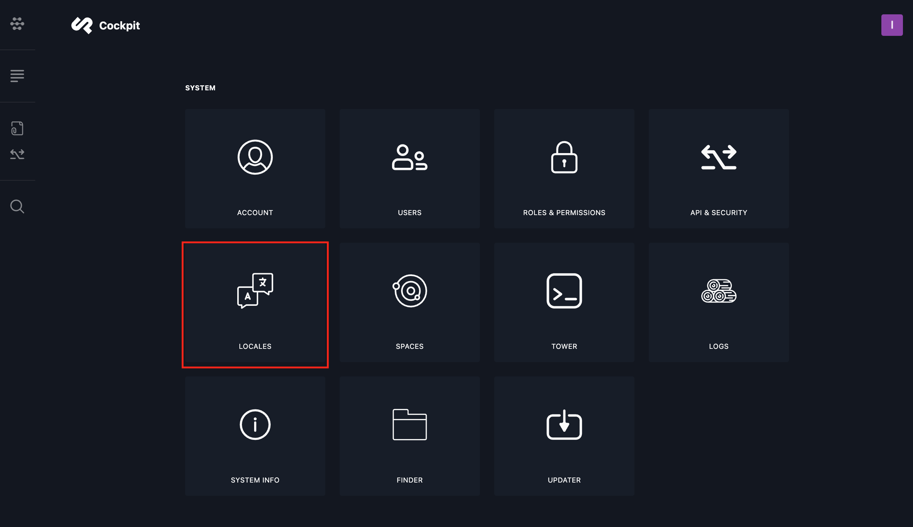

Set the language to the value of [SystemLanguage](https://docs.unity3d.com/ja/2021.3/ScriptReference/SystemLanguage.html). English should be set as the default language, so set other languages.

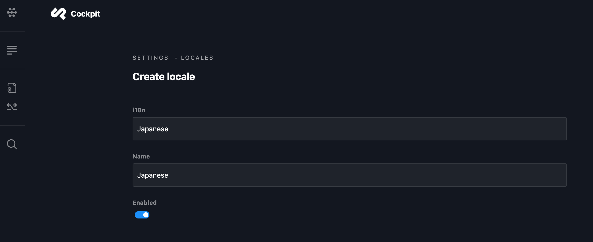

Turn on the Localize field of the Item you want to localize.

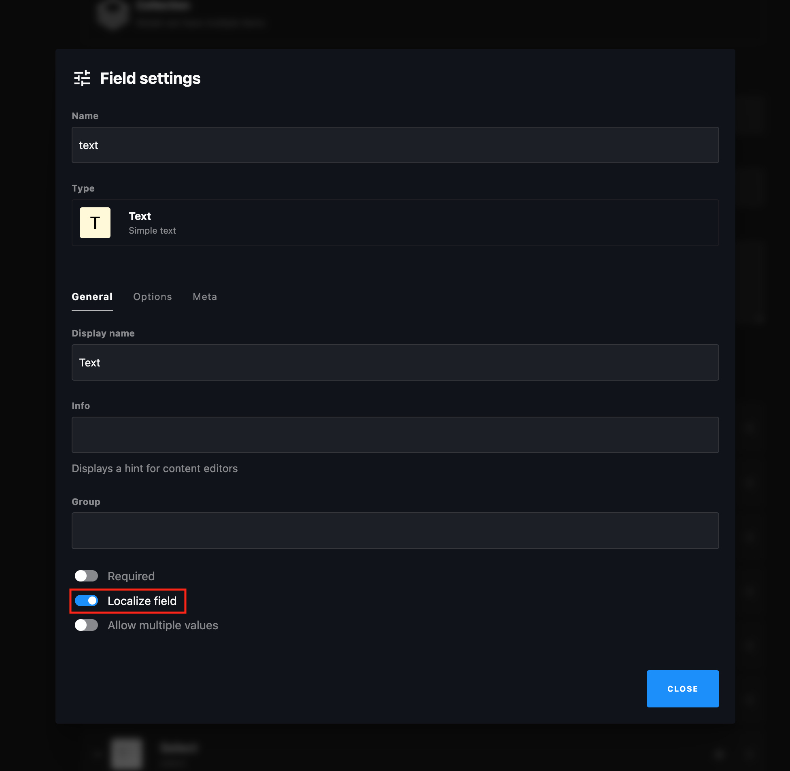

Then "TRANSLATION" will be displayed in the Item editing screen.

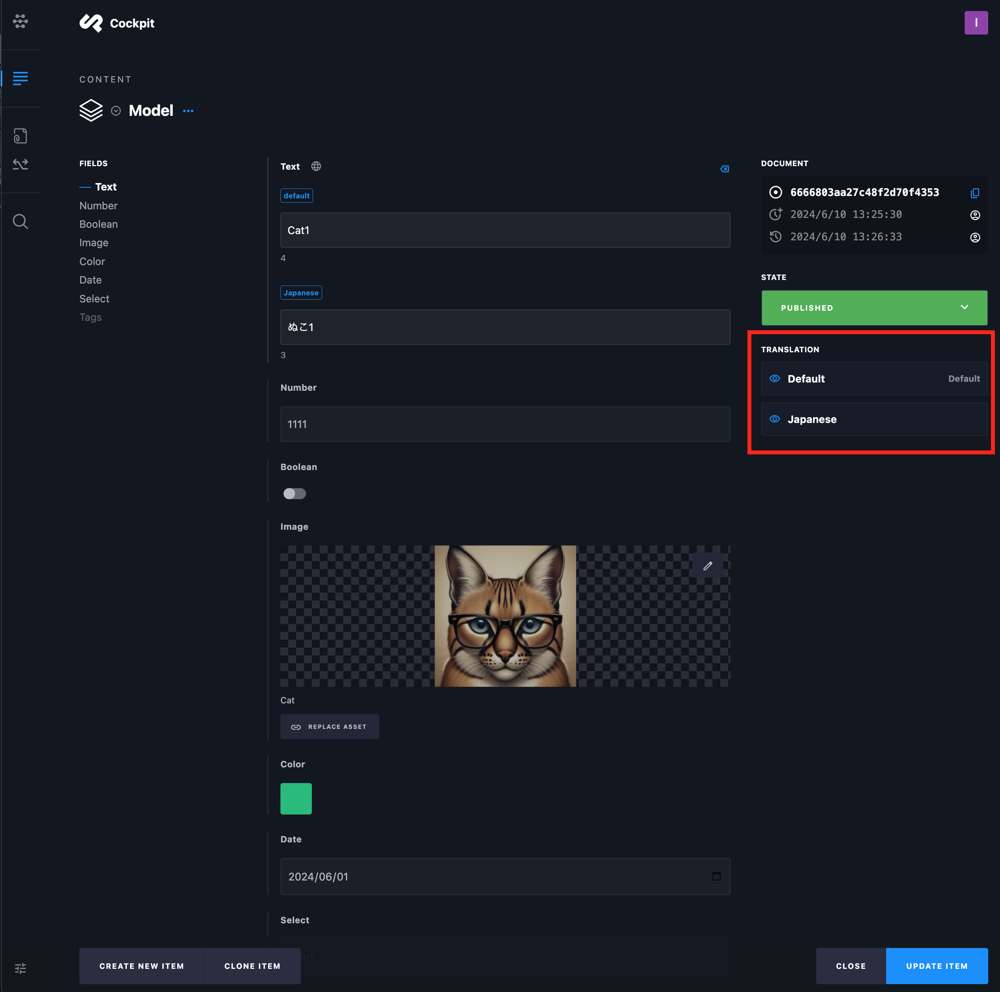