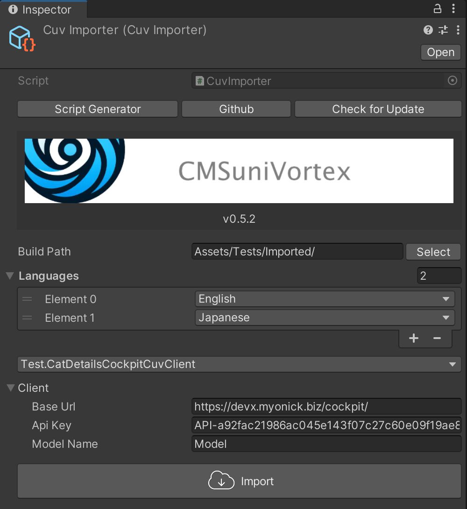

## Cockpitの必須環境

- PHPが使えるサーバー
- SQLite or MongoDB
- ローカルなら[Xampp](https://www.apachefriends.org/)でもできます。

詳しくは[Requirements](https://getcockpit.com/documentation/core/quickstart/requirements)を確認ください。

## Cockpitのインストール

[Cockpit](https://getcockpit.com/start-journey)からfreeの方をダウンロードしインストールします。インストールの詳細はここでは説明しません。

## コンテンツの設定

Collectionを設定します。NameはCuvImporterのClient > Model Nameに入力します。


### Fieldの追加

「ADD FIELD」をクリックします。


### Text


追加したものは下記のようにNameをIDとしてUnity上で取得できます。

```csharp
[Serializable]
public sealed class TestCockpitModel : CockpitModel
{
    public string Text;

    protected override void OnDeserialize()
    {
        Text = GetString("text");
    }
}
```

### Select

SelectやTagはOptionsから定数を追加できます。


`enum`に変換する事も可能です。

```csharp
[Serializable]
public sealed class TestCockpitModel : CockpitModel
{
    public ItemType Select;

    public enum ItemType { Item1, Item2, Item3 }

    protected override void OnDeserialize()
    {
        Select = GetSelect<ItemType>("select");
    }
}
```

### 一覧

下記以外にも、`GetStrings`などの複数取得系のメソッドもあります。

```csharp
using System;
using CMSuniVortex.Cockpit;
using UnityEngine;

namespace CMSuniVortex.Tests
{
    [Serializable]
    public sealed class TestCockpitModel : CockpitModel
    {
        public string Text;
        public long Number;
        public Sprite Image;
        public bool Boolean;
        public Color Color;
        public string Date;
        public ItemType Select;
        public TagType[] Tags;

        public enum TagType { Tag1, Tag2, Tag3 }

        public enum ItemType { Item1, Item2, Item3 }

        protected override void OnDeserialize()
        {
            Text = GetString("text");
            Number = GetLong("number");
            Boolean = GetBool("boolean");
            Color = GetColor("color");
            Date = GetDate("date");
            Select = GetSelect<ItemType>("select");
            Tags = GetTag<TagType>("tags");
            LoadSprite("image", asset => Image = asset);
        }
    }
}
```

### Itemの入力

Fieldを保存後、取得テストをするので適当に複数アイテム入力します。


### Roles

アイテムを入力したあとは、外部から取得できるようにRolesの設定をします。
左下の設定マークをクリック


ROLES & PERMISSIONSをクリック


右下の「ADD ROLE」から先ほど作成したItemsのReadのみを選択して「CREATE ROLE」で作成します。


左メニューのApiをクリックして先ほど作成したRoleを指定します。選択する場所が分かりづらいです。画像のドロップダウンの位置をクリックすると表示されます。


設定後、下記のようになります。「REST」をクリックして正常に動作するか確認します。
Api keyはCuvImporterのClient > Api Keyに入力します。


GET /content/items/{model}テストをします。ここで問題なく取得できるかを確認します。動作がおかしい場合も、まずこちらのテストを実行しJsonデータに問題無いか確認してください。


### インポート

Unity上に移動しCuvImporterの必要情報を入力しImportボタンをクリックしてください。
取得できれば完了です。



## 言語の設定

左下の設定マークから「LOCALES」を選択します。


言語は[SystemLanguage](https://docs.unity3d.com/ja/2021.3/ScriptReference/SystemLanguage.html)の値を設定してください。


Localize fieldをオンにしてください。


そうするとItemの編集画面に「TRANSLATION」が表示されるようになります。

