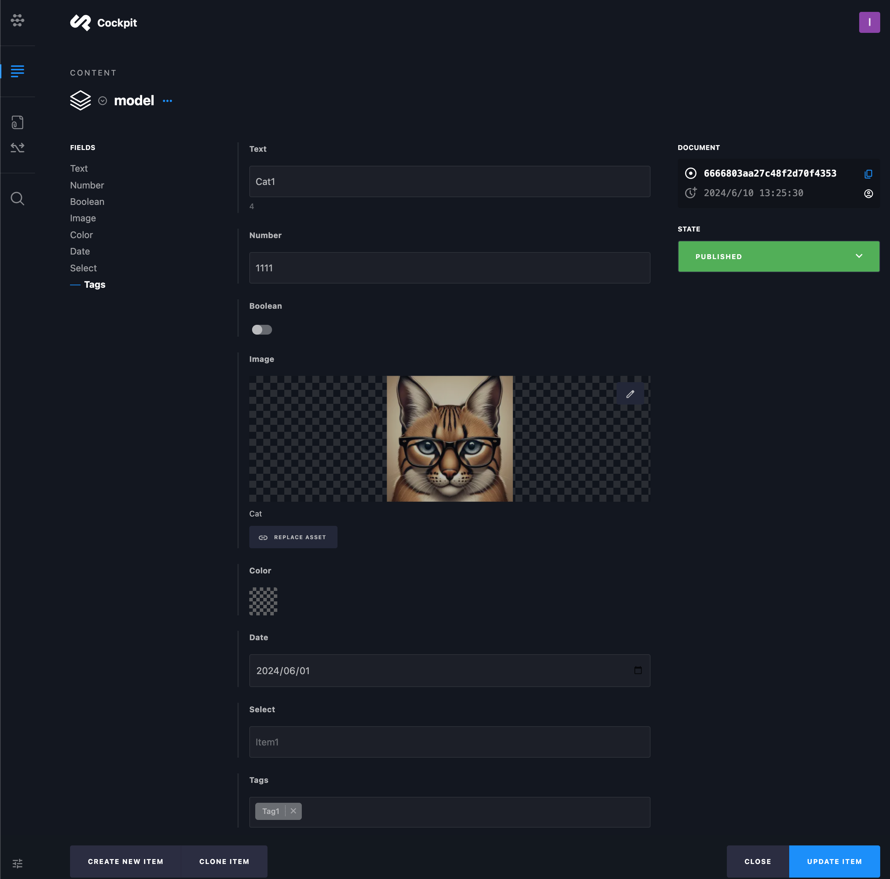
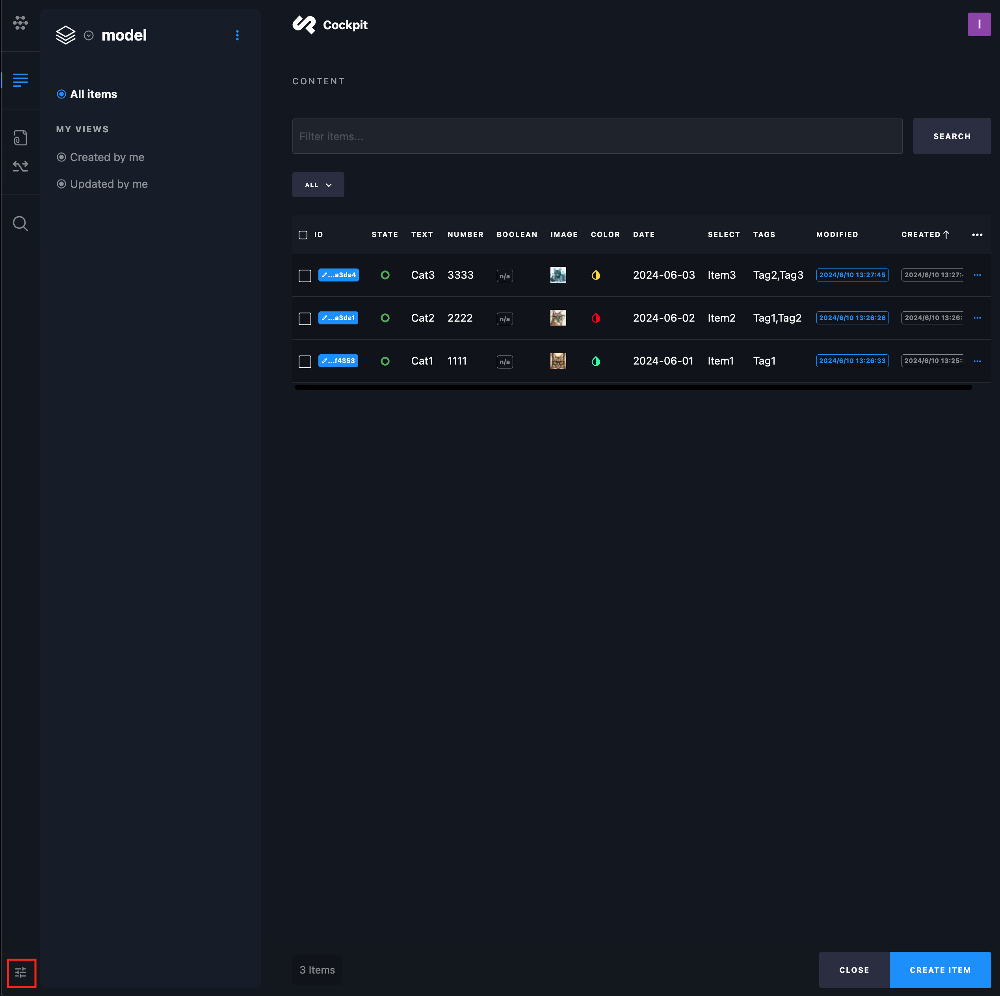
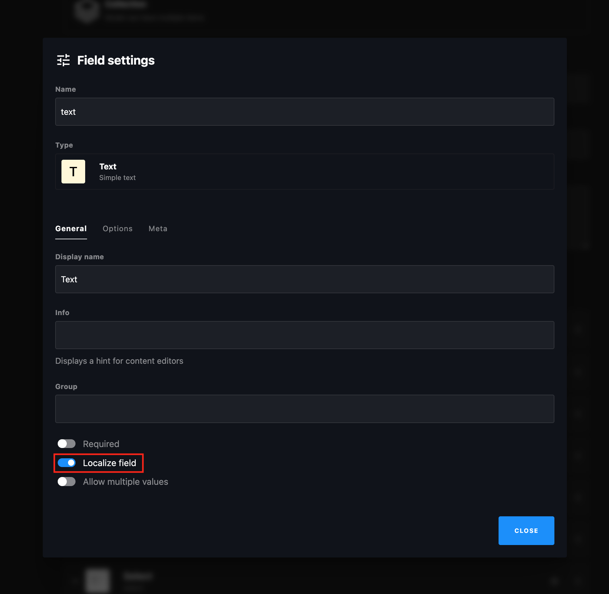

## Cockpitの必須環境

- PHPが使えるサーバー
- SQLite or MongoDB

詳しくは[Requirements](https://getcockpit.com/documentation/core/quickstart/requirements)を確認ください。

ローカルで使いたいなら[Xampp](https://www.apachefriends.org/)にインストールできます。

## Cockpitのインストール

[Cockpit](https://getcockpit.com/start-journey)からfreeの方をダウンロードしインストールします。インストールの詳細は省略します。

## コンテンツの設定

Collectionを設定します。設定したNameは後ほどUnity側で使います。


### Fieldの追加

「ADD FIELD」をクリックします。


### 必ず設定する値

Textの`Key`は必ず設定してください。Nameに`Key`または`key`を指定してください。


### Text


追加したものは下記のようにNameをIDとしてUnity上で取得できます。

```csharp
[Serializable]
public sealed class TestCockpitModel : CockpitModel
{
    public string Text;

    protected override void OnDeserialize()
    {
        Text = GetString("text");
    }
}
```

### Select

SelectやTagはOptionsから定数を追加できます。


`enum`に変換すると使いやすいです。

```csharp
[Serializable]
public sealed class TestCockpitModel : CockpitModel
{
    public ItemType Select;

    public enum ItemType { Item1, Item2, Item3 }

    protected override void OnDeserialize()
    {
        Select = GetSelect<ItemType>("select");
    }
}
```

### 一覧

下記以外にも、`GetStrings(key)`などの複数取得系のメソッドもあります。

```csharp
using System;
using CMSuniVortex.Cockpit;
using UnityEngine;

namespace CMSuniVortex.Tests
{
    [Serializable]
    public sealed class TestCockpitModel : CockpitModel
    {
        public string Text;
        public long Number;
        public Sprite Image;
        public bool Boolean;
        public Color Color;
        public string Date;
        public ItemType Select;
        public TagType[] Tags;

        public enum TagType { Tag1, Tag2, Tag3 }

        public enum ItemType { Item1, Item2, Item3 }

        protected override void OnDeserialize()
        {
            Text = GetString("text");
            Number = GetLong("number");
            Boolean = GetBool("boolean");
            Color = GetColor("color");
            Date = GetDate("date");
            Select = GetSelect<ItemType>("select");
            Tags = GetTag<TagType>("tags");
            LoadSprite("image", asset => Image = asset);
        }
    }
}
```

Addressable対応の`CuvClient`を選択した場合、`AssetReference`を使えます。

```csharp
using System;
using CMSuniVortex.Cockpit;
using UnityEngine.AddressableAssets;

[Serializable]
public sealed class CatAddressableDetails : CockpitModel
{
    public AssetReferenceSprite Sprite;
    public AssetReferenceTexture2D Texture;

    protected override void OnDeserialize()
    {
        LoadSpriteReference("image", asset => Sprite = asset);
        LoadTextureReference("image2", asset => Texture = asset);
    }
}
```

### Itemの入力

Fieldを保存後、取得テストをするので適当に複数のItemを入力します。



### Roles

Itemを入力後、外部から取得できるようにRolesを設定します。
左下の設定マークをクリック



ROLES & PERMISSIONSをクリック


右下の「ADD ROLE」から先ほど作成したCONTENTのItemsのReadのみを選択して「CREATE ROLE」で作成します。


左メニューのApiをクリックして先ほど作成したRoleを指定します。選択する箇所が分かりづらいです。画像のドロップダウンが表示されている位置をクリックしてください。


設定後、下記のようになります。「REST」をクリックして正常に動作するか確認します。


GET /content/items/{model}テストをします。ここで問題なく取得できるかを確認します。何か動作がおかしい場合は、まずこちらのテストを実行するという事を覚えておいてください。


### インポート

Unity上に移動し`CuvImporter`の必要情報を入力しImportボタンをクリックしてください。取得できれば完了です。Unity側の設定詳細は[Readme](README_jp.md)をごらんください。

|            | explanation                                 | e.g.                          |
|------------|---------------------------------------------|-------------------------------|
| Build Path | アセットを生成するパス                                 | Assets/Generated/ |
| Languages  | 言語を指定、利用していなくても必ず1つ選択する必要があります。             | English |
| Base Url   | CockpitのURL                                 | https://devx.myonick.biz/cockpit/ |
| Api Key   | [Roles](#Roles)に設定したApi Key                 | API-a92fac21986ac045e143f07c27c60e09f19ae‹ |
| Model Name   | [cockpitのインストール](#cockpitのインストール) で設定したName | Model  |


## 言語の設定

左下の設定マークから「LOCALES」を選択します。


言語は[SystemLanguage](https://docs.unity3d.com/ja/2021.3/ScriptReference/SystemLanguage.html)の値を設定してください。英語はDefaultにした方が良いのでそれ以外の言語を設定します。


ローカライズしたいItemのLocalize fieldをオンにしてください。



そうするとItemの編集画面に「TRANSLATION」が表示されるようになります。

