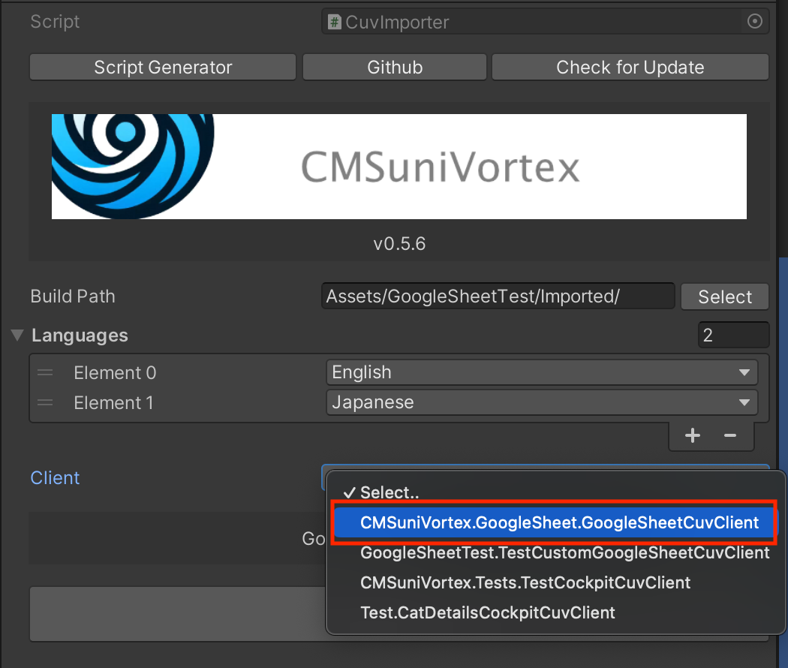
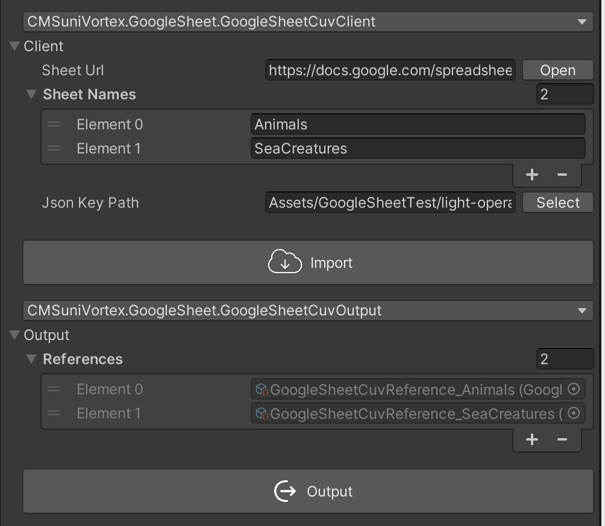
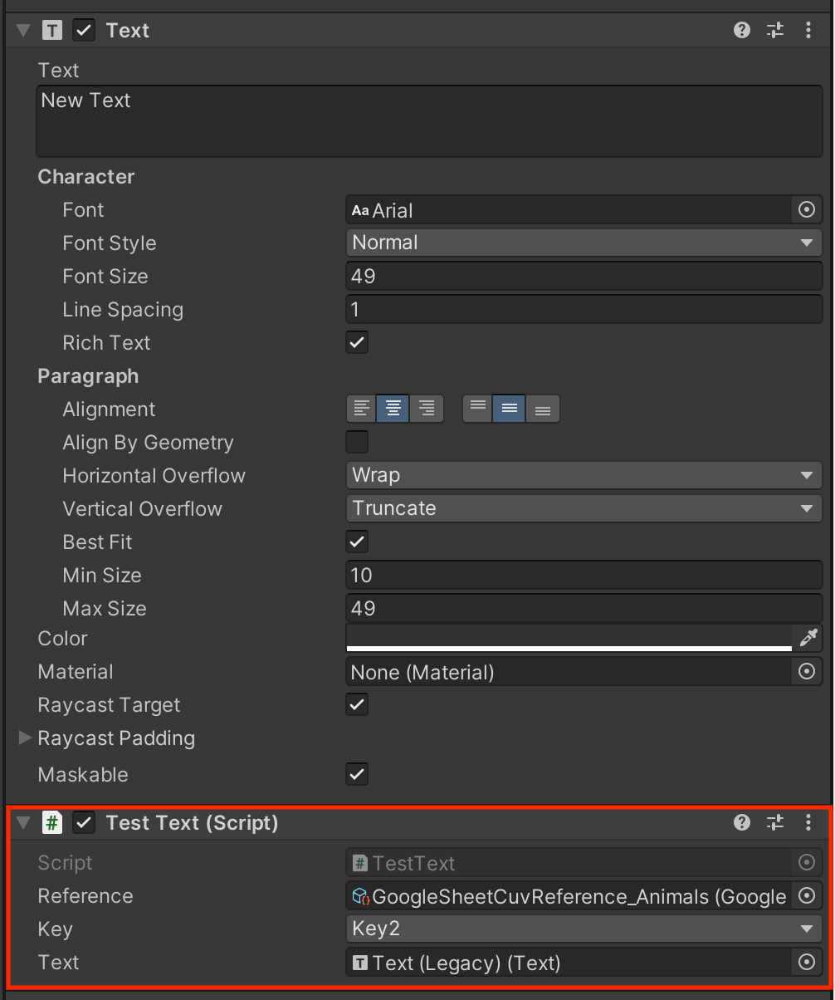
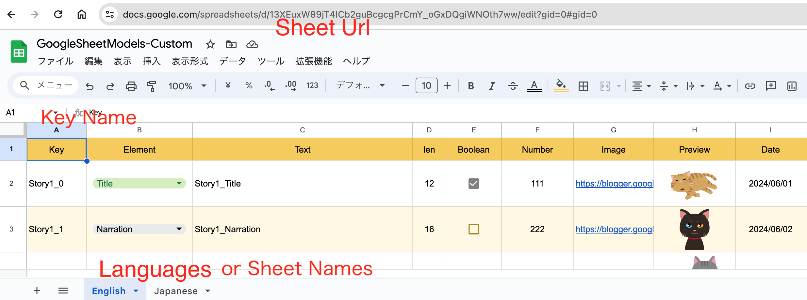
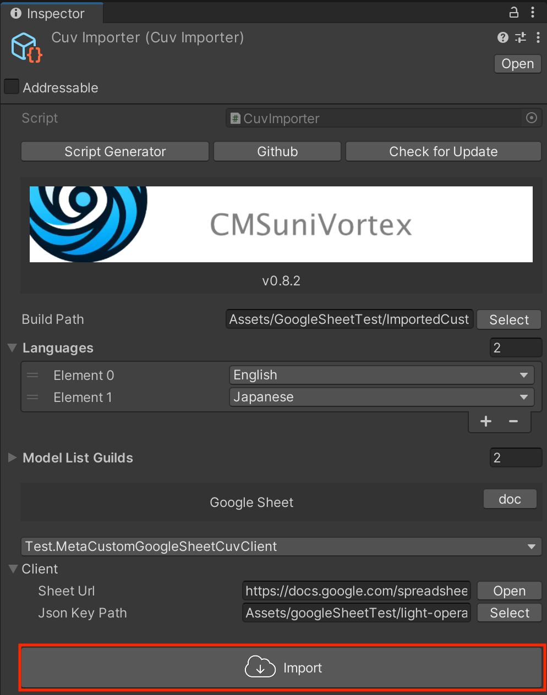
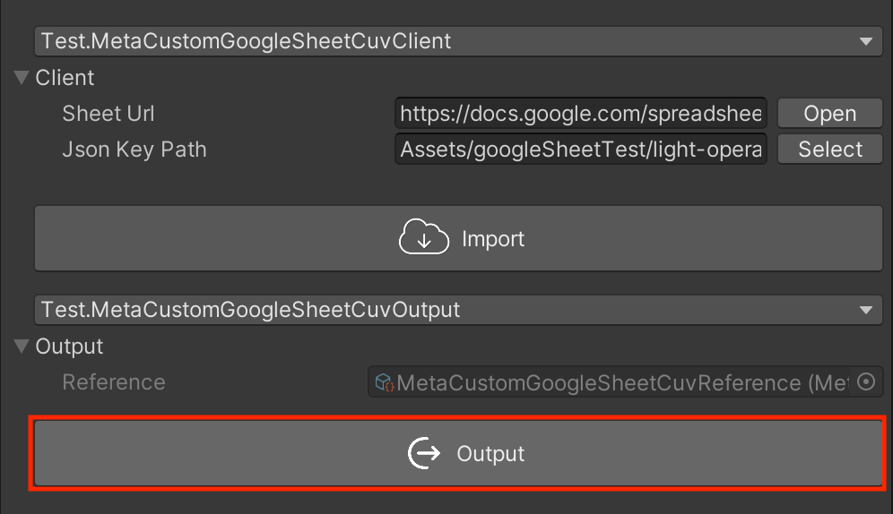
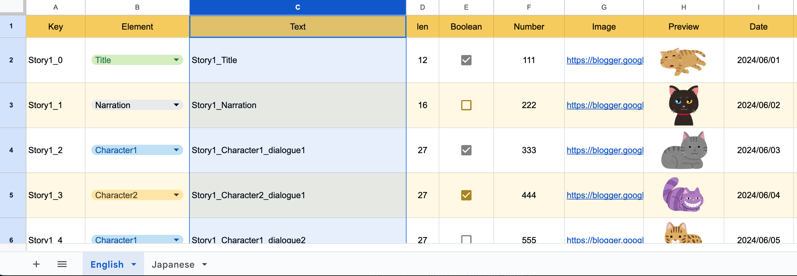

[日本語](IntegrationWithGoogleSheet_jp.md)

## What You Need for Google Sheets

- [Google Account](https://www.google.com/intl/ja/account/about/)
- [Google Cloud Account](https://console.cloud.google.com/)

### If you haven't set up settings yet, please complete it from [Initial Setup](InitialSetupOfGoogleSheet.md) 

## Two Types Prepared

There are two types, so please use the one that fits your needs.

- [Simple](#simple) - A simple one with only Key + language-specific text
- [Custom](#custom) - A versatile one that can be customized

## Simple

Although you can't change the structure of the spreadsheet, you can use it immediately without generating any scripts.

### Generating the Spreadsheet

- Open the [sample spreadsheet](https://docs.google.com/spreadsheets/d/19DrEi35I7H8f6bcUcORGIaUK8MmeLZ-ljkh7Fkbcxtw/)
- Make a copy by going to "File > Make a Copy"
- Please set the [sharing settings](InitialSetupOfGoogleSheet.md#Sharing-settings-of-the-spreadsheet) on the copied file.

### Generate CuvImporter

Right-click on the Project and select `CuvImporter` from "CMSuniVortex > create CuvImporter".


Select `CMSuniVortex.GoogleSheet.GoogleSheetCuvClient` as client



### Enter Required Information in CuvImporter

|               | explanation                                                             | e.g.                                             
|---------------|-------------------------------------------------------------------------|--------------------------------------------------|
| Build Path    | Path to generate assets                                                 | Assets/Generated/                                
| Languages     | Specify the language, even if not in use, you must select at least one. | English                                          
| Sheet Url     | Specify the URL of the spreadsheet                                      | https://docs.google.com/spreadsheets/d/sheetID/  
| Sheet Names   | Name of the tab at the bottom of the spreadsheet                        | Animals, SeaCreatures                            
| Json Key Path | Path where the service account is saved                                 | Assets/GoogleSheetTest/light-operator-x-x-x.json 
| Key Name      | You can change the required Key name in the sheet                       | Key                                              |


### Import

After entering, please click "Import". If it is output without errors, it is complete.


### Output

Specify how to reference. This time, we specified `GoogleSheetCuvOutput` which is a direct reference.



### Acquisition and Display

The easiest way is to use `CuvLocalized<T>`. Save the code below under Assets folder and attach it to `Text`, then enter
the required information.

#### Component Section

Create a parent class specifying the `CuvReference` that was output in Output.
```csharp
using CMSuniVortex;

namespace Test.Cockpit
{
    public abstract class CuvLocalizedTest : CuvLocalized<GoogleSheetCuvReference>
    {
        protected abstract void OnChangeLanguage(GoogleSheetModel catDetails);
        
        protected override void OnChangeLanguage(GoogleSheetCuvReference reference, string key)
        {
            if (reference.TryGetByKey(key, out var model))
            {
                OnChangeLanguage(model);
            }
        }
    }
}
```

Create a script that inherits from the above class to display text.
```csharp
using UnityEngine;
using UnityEngine.UI;

[RequireComponent(typeof(Text))]
public sealed class CuvLocalizedTextTest : CuvLocalizedTest
{
    [SerializeField] Text _text;

    protected override void OnChangeLanguage(CatDetailsLocalize model)
    {
        _text.text = model.Text;
    }
    
    protected override void Reset()
    {
        base.Reset();
        _text = GetComponent<Text>();
    }
}
```

You can display the `Text` variable matching the selected Key as shown below.



#### Script Section

Using the `CuvReference` outputted in Output, bind the `OnChangeLanguage` event to display.

```csharp

using System.Threading;
using UnityEngine;
using UnityEngine.AddressableAssets;
using UnityEngine.ResourceManagement.AsyncOperations;
using CMSuniVortex;

public sealed class InitializeLocalizationTest : MonoBehaviour
{
    [SerializeField] GoogleSheetCuvAddressableReference _reference;

    void OnEnable()
    {
        _reference.OnChangeLanguage += OnChangeLanguage;
        if (_reference.IsInitializedLocalize)
        {
            OnChangeLanguage(_reference.ActiveLanguage);
        }
    }

    void OnDisable()
    {
        _reference.OnChangeLanguage -= OnChangeLanguage;
    }
    
    void OnChangeLanguage(SystemLanguage language)
    {
        var obj = _reference.ActiveLocalizedList[1];
        Debug.Log("OnChangeLanguage : " + obj.Text);
    }
}
```

## Custom

You can freely change anything other than the first Key of the spreadsheet. Script generation is required.

### Generating the Spreadsheet

For first-time users, it's easier to understand by copying and using the sample sheet.

- Open the [sample spreadsheet](https://docs.google.com/spreadsheets/d/13XEuxW89jT4ICb2guBcgcgPrCmY_oGxDQgiWNOth7ww).
- Make a copy by going to "File > Make a Copy"
- Please set the [sharing settings](InitialSetupOfGoogleSheet.md#Sharing-settings-of-the-spreadsheet) on the copied file.

### Generate CuvImporter

Right-click on the Project and select `CuvImporter` from "CMSuniVortex > create CuvImporter".


Click on the "Script Generator" button of the generated CuvImporter


### Script Generation

Please enter the necessary information and generate.


|                  | explanation                                                 | e.g.                |
|------------------|-------------------------------------------------------------|---------------------|
| Full Class Name  | Specify the class name. You can also specify the namespace. | namespace.ClassName |
| Build Path       | Specify the directory path to generate the code             | Assets/Models/      
| Use addressables | Output code using addressables?                             |                     |
| Use localization | Output code for localization?                               |                     |
| Generate output  | Output code for output?                                     |                     |

#### Example) When generating with class name Test.Meta

The following classes will be generated based on your selections:

| Client                                                             | Type                        |
|--------------------------------------------------------------------|-----------------------------|
| Test.MetaCustomGoogleSheetCuvClient                                | Normal                      |
| Test.MetaAddressableCustomGoogleSheetCuvAddressableClient          | Addressables                |
| Test.MetaCustomGoogleSheetCuvLocalizedClient                       | Localization                |
| Test.MetaAddressableCustomGoogleSheetCuvAddressableLocalizedClient | Addressables + Localization |

| Output                                                    | Type         |
|-----------------------------------------------------------|--------------|
| Test.MetaCustomGoogleSheetCuvOutput                       | Normal       |
| Test.MetaAddressableCustomGoogleSheetCuvAddressableOutput | Addressables |

### Enter Required Information in CuvImporter

Select the generated Client.

- If you are using Addressables, please specify a Client that includes "Addressable" in its name
- If localization is required, please specify a Client that includes "Localized" in its name


Enter the information.


|                              | explanation                                          | e.g.                                             |
|------------------------------|------------------------------------------------------|--------------------------------------------------|
| Build Path                   | Path to generate assets                              | Assets/Generated/                                |
| Sheet Url                    | Specify the spreadsheet URL                          | https://docs.google.com/spreadsheets/d/sheetID/  |
| Json Key Path                | Path where service account is saved                  | Assets/GoogleSheetTest/light-operator-x-x-x.json |
| Key Name                     | You can change the required unique key name in sheet | Key                                              |
| Sheet Names                  | Specify sheet name, at least one required            | Sheet1                                           |
| [For localization] Languages | Specify language, at least one required              | English                                          |



### Import

Click the "Import" button to import. After import, if it is output without errors, it is successful.



### Output

Specify how to reference. This time, we specified the 'CustomGoogleSheetCuvOutput' which is a direct reference. Click "Output" to output.



### Always Set Key
Please be sure to set the first 'Key' of the sheet. Also, make sure that this key is not duplicated.

## Custom Method

Let's check how the deserialization process works (when converting sheet data to ScriptableObject) for the generated
class, in this case, the `Meta` class.



The 'Text' column of the sheet can be retrieved with the model's `Text = GetString("Text");`.

```csharp
public sealed class Meta : CustomGoogleSheetModel
{
    public ElementType Element;
    public string Text; // <--
    public bool Boolean;
    public int Number;
    public Sprite Image;
    public string Date;
    
    public enum ElementType { Title, Narration, Character1, Character2, Character3, TextOnly }

    protected override void OnDeserialize()
    {
        Element = GetEnum<ElementType>("Element");
        Text = GetString("Text"); // <--
        Boolean = GetBool("Boolean");
        Number = GetInt("Number");
        Date = GetDate("Date");
        
        LoadSprite("Image", sprite => Image = sprite);
    }
}
```

If you choose the Addressable-compatible `CuvClient`, you can use `AssetReference`.

```csharp
using System;
using CMSuniVortex.GoogleSheet;
using UnityEngine.AddressableAssets;

[Serializable]
public sealed class MetaAddressable : CustomGoogleSheetModel
{
    public AssetReferenceSprite Sprite;
    public AssetReferenceTexture2D Texture;

    protected override void OnDeserialize()
    {
        LoadSpriteReference("Image", asset => Sprite = asset);
        LoadTextureReference("Image2", asset => Texture = asset);
    }
}
```

### Addition
We will explain how to add. First, we want to try adding a Float to the English sheet.


We add Float to the generated model and add deserialization processing.

```csharp
public sealed class Meta : CustomGoogleSheetModel
{
    public ElementType Element;
    public string Text;
    public bool Boolean;
    public int Number;
    public Sprite Image;
    public string Date;
    public float Float; // <--
    
    public enum ElementType { Title, Narration, Character1, Character2, Character3, TextOnly }

    protected override void OnDeserialize()
    {
        Element = GetEnum<ElementType>("Element");
        Text = GetString("Text");
        Boolean = GetBool("Boolean");
        Number = GetInt("Number");
        Date = GetDate("Date");
        Float = GetFloat("Float"); // <--
        
        LoadSprite("Image", sprite => Image = sprite);
    }
}
```

After adding, we import.


If it's added without any errors, like shown below, then it's complete. By removing or adding in this manner, try creating your own original sheet.


### Importing Google Sheet

> [!TIP]
> For the `Japanese` sheet, it's easier to import from the `English` sheet except for parts that need translation. Below
> shows the `English` sheet cells E to J displayed using the `IMPORTRANGE` function.

```javascript
// Sheet url, Sheet name + cells
=IMPORTRANGE("https://docs.google.com/spreadsheets/d/13XEuxW89jT4ICb2guBcgcgPrCmY_oGxDQgiWNOth7ww/", "English!E:J")
```


### Acquisition and Display

Refer to Simple.

## Google API Libraries

We are using the official libraries for data retrieval.

[https://www.nuget.org/profiles/google-apis-packages](https://www.nuget.org/profiles/google-apis-packages)

- Google.Apis
- Google.Apis.Core
- Google.Apis.Auth
- Google.Apis.Drive.v3
- Google.Apis.Sheets.v4