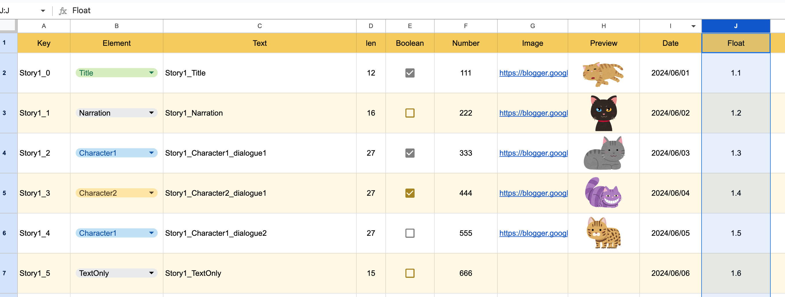

[日本語](IntegrationWithGoogleSheet_jp.md)

### Generate CuvImporter

Right-click on the Project and select "CMSuniVortex > create CuvImporter" to generate `CuvImporter`.


Click the "Script Generator" button of the generated CuvImporter


### Generate the script

Fill in the required information to generate it.

|                 | Explanation                   | e.g.                |
|-----------------|-------------------------------|---------------------|
| Full Class Name | Specify the class name. You can also specify a namespace. | namespace.ClassName |
| Build Path      | Specify the directory path where the code will be generated.          | Assets/Models/      |


### Enter the necessary information for CuvImporter

Select the generated Client for Client


Fill in the information.

|            | explanation                     | e.g.                                             |
|------------|---------------------------------|--------------------------------------------------|
| Build Path | Path to generate assets                     | Assets/Generated/                                |
| Languages  | Specify a language. Even if not used, you must always select one. | English                                          |
| Sheet ID   | ID contained in the URL of the spreadsheet  | 19DrEi35I7H8f6bcUcORGIaUK8MmeLZ-ljkh7Fkbcxtw     |
| Json Key Path   | The path where you saved the service account  | Assets/GoogleSheetTest/light-operator-x-x-x.json |


### Import

Click the import button to import.
After import, if there are no errors and it has been output to `Build Path`, it is successful.


## Custom Method

The 'Text' of the sheet


matches the `public string Text;` of the generated model. This is because `"Text"` of `Text = GetString("Text");` matches the name of the first cell of the spreadsheet.

```csharp
public sealed class Meta : CustomGoogleSheetModel
{
    public ElementType Element;
    public string Text;
    public bool Boolean;
    public int Number;
    public Sprite Image;
    public string Date;
    
    public enum ElementType { Title, Narration, Character1, Character2, Character3, TextOnly }

    protected override void OnDeserialize()
    {
        Element = GetEnum<ElementType>("Element");
        Text = GetString("Text"); // <--
        Boolean = GetBool("Boolean");
        Number = GetInt("Number");
        Date = GetDate("Date");
        
        LoadSprite("Image", sprite => Image = sprite);
    }
}
```

### Adding
Let's explain how to add. First, I want to add Float to the English sheet.



Japanese is easy to import English sheets except where translation is needed. Cells E~J of English are displayed using the IMPORTRANGE function.

```javascript
// Sheet url, Sheet name + cells
=IMPORTRANGE("https://docs.google.com/spreadsheets/d/13XEuxW89jT4ICb2guBcgcgPrCmY_oGxDQgiWNOth7ww/", "English!E:J")
```


Add Float to the generated model and add deserialization processing.

```csharp
public sealed class Meta : CustomGoogleSheetModel
{
    public ElementType Element;
    public string Text;
    public bool Boolean;
    public int Number;
    public Sprite Image;
    public string Date;
    public float Float; // <--
    
    public enum ElementType { Title, Narration, Character1, Character2, Character3, TextOnly }

    protected override void OnDeserialize()
    {
        Element = GetEnum<ElementType>("Element");
        Text = GetString("Text");
        Boolean = GetBool("Boolean");
        Number = GetInt("Number");
        Date = GetDate("Date");
        Float = GetFloat("Float"); // <--
        
        LoadSprite("Image", sprite => Image = sprite);
    }
}
```

After adding, import.


If there are no errors, and it has been added as shown below, you have completed. Please try to make your original sheet by adding or deleting in this way.

