## Google Sheetに必要なもの

- [Google アカウント](https://www.google.com/intl/ja/account/about/)
- [Google Cloud アカウント](https://console.cloud.google.com/)

### 設定がまだの方は[初期設定](InitialSetupOfGoogleSheet_jp.md)から完了させてください。

## ２つのタイプを用意

用途に合わせて使ってください。

- [Simple](#simple) - Key + 言語別のテキストのみのシンプルなもの
- [Custom](#custom) - カスタムできる汎用性の高いもの

## Simple

スプレッドシートの構成を変更できませんが、スクリプトの生成無しにすぐ使う事ができます。

### スプレッドシートの生成

- [スプレッドシートのサンプル](https://docs.google.com/spreadsheets/d/19DrEi35I7H8f6bcUcORGIaUK8MmeLZ-ljkh7Fkbcxtw/)を開く
- 「ファイル > コピーを作成」でコピーしてください
- コピーしたファイルに[共有設定](InitialSetupOfGoogleSheet_jp.md#スプレッドシートの共有設定)をしてください

### CuvImporterを生成

Project上を右クリックし「CMSuniVortex > create CuvImporter」から`CuvImporter`を生成します。

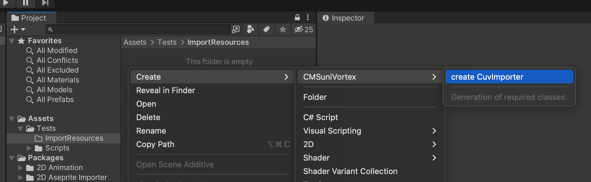

Clientに`CMSuniVortex.GoogleSheet.GoogleSheetCuvClient`を選択

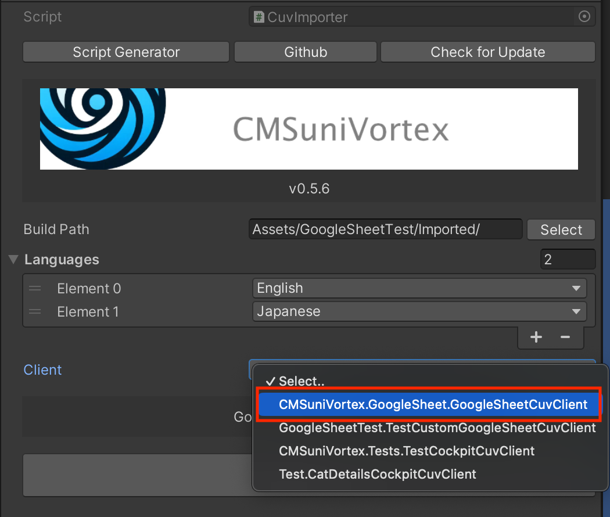

### CuvImporterに必要情報の入力

|               | explanation                     | e.g.                              |
|---------------|---------------------------------|-----------------------------------|
| Build Path    | アセットを生成するパス                     | Assets/Generated/                 |
| Languages     | 言語を指定、利用していなくても必ず1つ選択する必要があります。 | English                           |
| Sheet Url     | スプレッドシートのURLを指定                 | https://docs.google.com/spreadsheets/d/sheetID/ |
| Sheet Names   | スプレッドシートの下段タブ名                  | Animals, SeaCreatures             |
| Json Key Path | サービスアカウントを保存したパス                | Assets/GoogleSheetTest/light-operator-x-x-x.json |
| Key Name      | シートに必ず必要なKey名を変更できます            | Key |

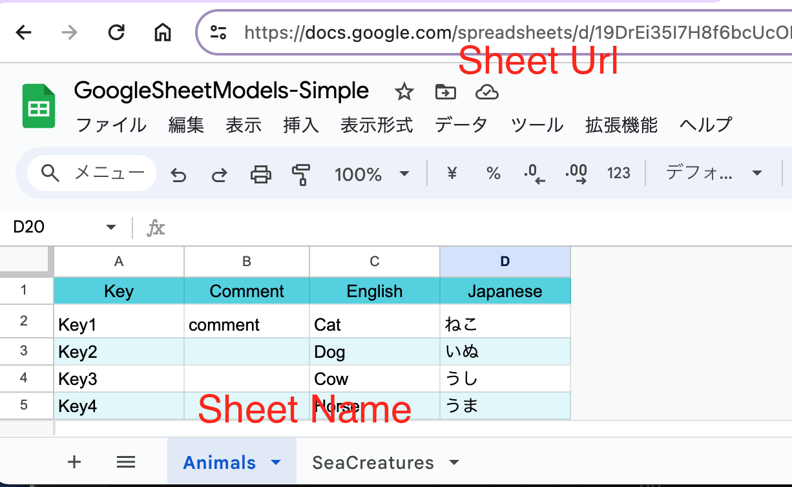

### Import

入力後、「Import」をクリックしてください。エラー無く出力されていれば完了です。

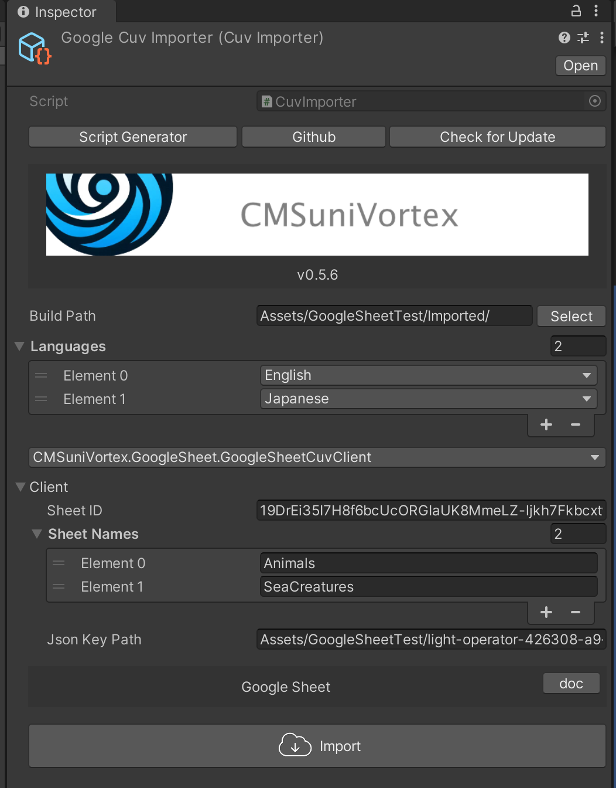

### Output

どうやって参照するかを指定します。今回は直接参照の`GoogleSheetCuvOutput`を指定しました。

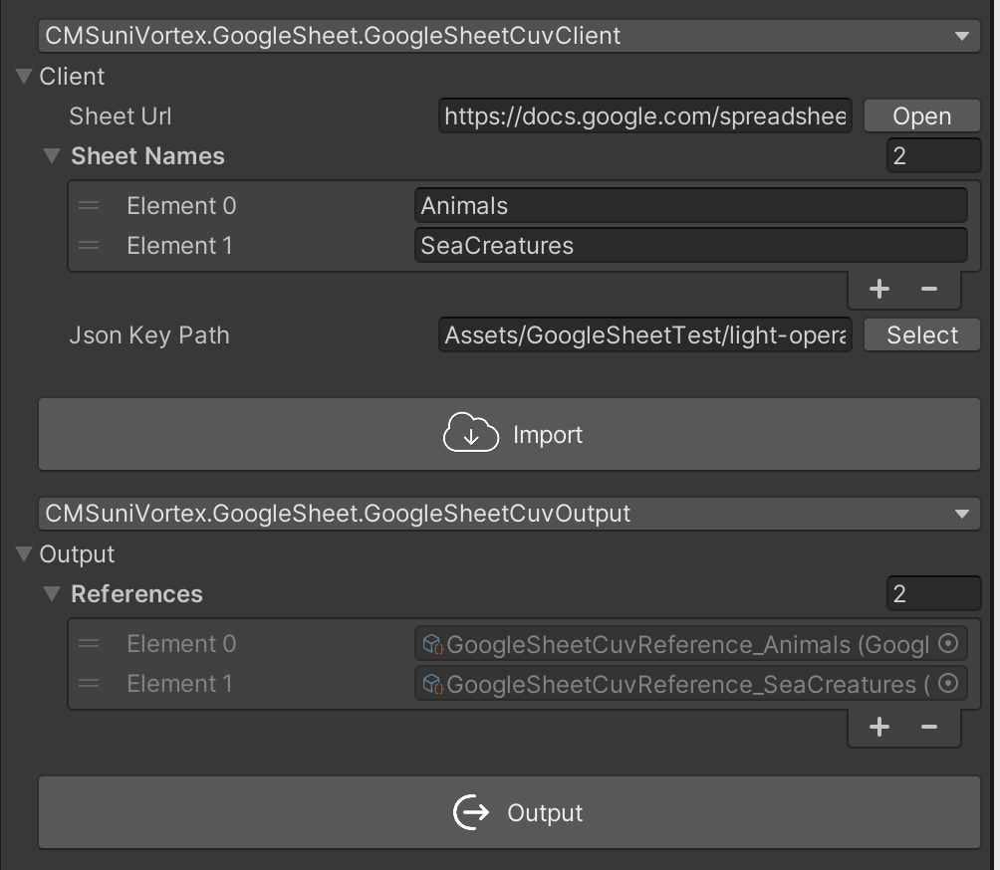

### 取得と表示

一番簡単な方法は`CuvLocalized<T>`を使う事です。下記のコードをAssets配下に保存、`Text`にアタッチして必要情報を入力してください。

#### コンポーネント編

Outputで出力された対象の`CuvReference`を指定した親クラスを作ります。
```csharp
using CMSuniVortex;

namespace Test.Cockpit
{
    public abstract class CuvLocalizedTest : CuvLocalized<GoogleSheetCuvReference>
    {
        protected abstract void OnChangeLanguage(GoogleSheetModel catDetails);
        
        protected override void OnChangeLanguage(GoogleSheetCuvReference reference, string key)
        {
            if (reference.TryGetByKey(key, out var model))
            {
                OnChangeLanguage(model);
            }
        }
    }
}
```

上記のクラスを継承して、テキストを表示するスクリプトを作ります。
```csharp
using UnityEngine;
using UnityEngine.UI;

[RequireComponent(typeof(Text))]
public sealed class CuvLocalizedTextTest : CuvLocalizedTest
{
    [SerializeField] Text _text;

    protected override void OnChangeLanguage(CatDetailsLocalize model)
    {
        _text.text = model.Text;
    }
    
    protected override void Reset()
    {
        base.Reset();
        _text = GetComponent<Text>();
    }
}
```

下記のようにKeyを選択する事で、Keyに合った`Text`という変数を表示できます。

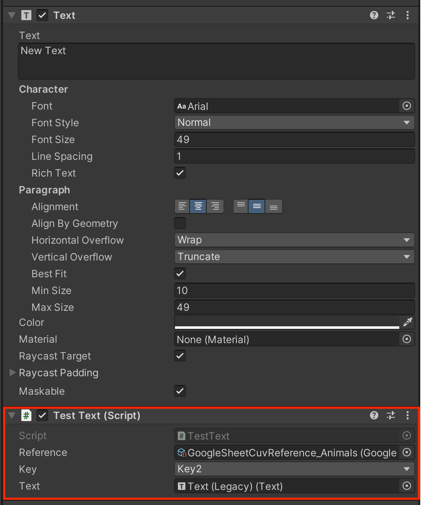

#### スクリプト編

Outputで出力された対象の`CuvReference`を使い`OnChangeLanguage`イベントをバインドして表示します。

```csharp

using System.Threading;
using UnityEngine;
using UnityEngine.AddressableAssets;
using UnityEngine.ResourceManagement.AsyncOperations;
using CMSuniVortex;

public sealed class InitializeLocalizationTest : MonoBehaviour
{
    [SerializeField] GoogleSheetCuvAddressableReference _reference;

    void OnEnable()
    {
        _reference.OnChangeLanguage += OnChangeLanguage;
        if (_reference.IsInitializedLocalize)
        {
            OnChangeLanguage(_reference.ActiveLanguage);
        }
    }

    void OnDisable()
    {
        _reference.OnChangeLanguage -= OnChangeLanguage;
    }
    
    void OnChangeLanguage(SystemLanguage language)
    {
        var obj = _reference.ActiveLocalizedList[1];
        Debug.Log("OnChangeLanguage : " + obj.Text);
    }
}
```

## Custom

スプレッドシートの1番目のKey以外は自由に変更できます。スクリプトの生成が必要です。

### スプレッドシートの生成

- [スプレッドシートのサンプル](https://docs.google.com/spreadsheets/d/13XEuxW89jT4ICb2guBcgcgPrCmY_oGxDQgiWNOth7ww)を開く
- 「ファイル > コピーを作成」でコピーしてください
- コピーしたファイルに[共有設定](InitialSetupOfGoogleSheet_jp.md#スプレッドシートの共有設定)をしてください

### CuvImporterを生成

Project上を右クリックし「CMSuniVortex > create CuvImporter」から`CuvImporter`を生成します。


生成したCuvImporterの「Script Generator」ボタンをクリック

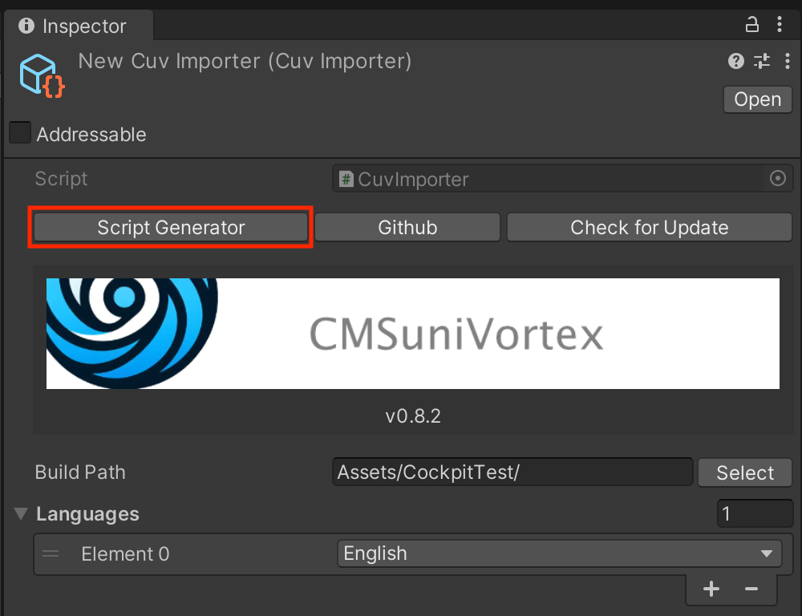

### スクリプト生成

必要情報を入力して生成してください。

|                 | explanation                   | e.g.                |
|-----------------|-------------------------------|---------------------|
| Full Class Name | クラス名を指定。namespaceを指定する事も可能です。 | namespace.ClassName |
| Build Path      | コードを生成するディレクトリのパスを指定          | Assets/Models/      |

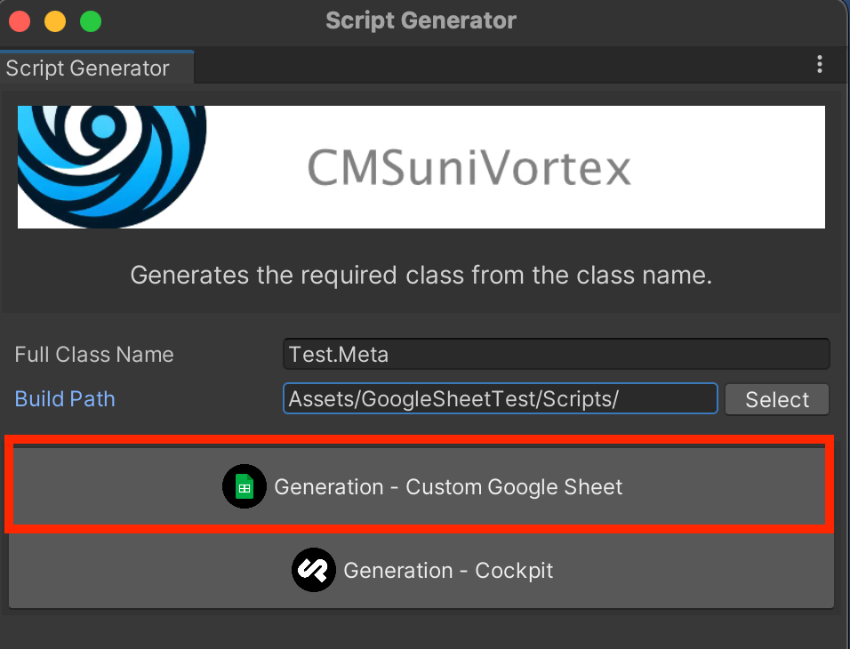

### CuvImporterに必要情報の入力

生成したClientを選択します。

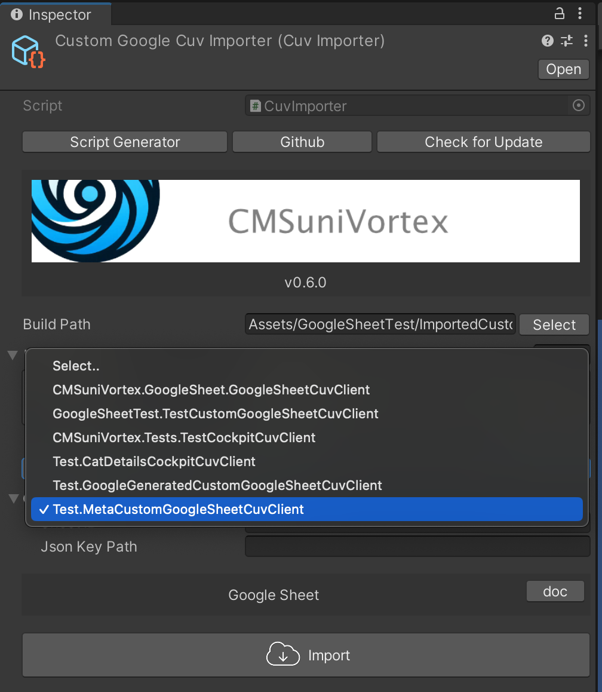

情報を入力します。

|            | explanation                     | e.g.                                             |
|------------|---------------------------------|--------------------------------------------------|
| Build Path | アセットを生成するパス                     | Assets/Generated/ |
| Languages  | 言語を指定、利用していなくても必ず1つ選択する必要があります。 | English |
| Sheet Url   | スプレッドシートのURLを指定  | https://docs.google.com/spreadsheets/d/sheetID/|
| Json Key Path   | サービスアカウントを保存したパス  | Assets/GoogleSheetTest/light-operator-x-x-x.json |

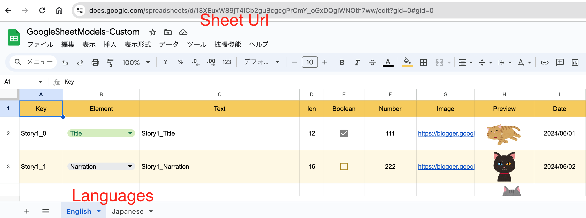

### Import

「Import」ボタンをクリックしてインポートします。インポート後、エラー無く出力されていれば成功です。

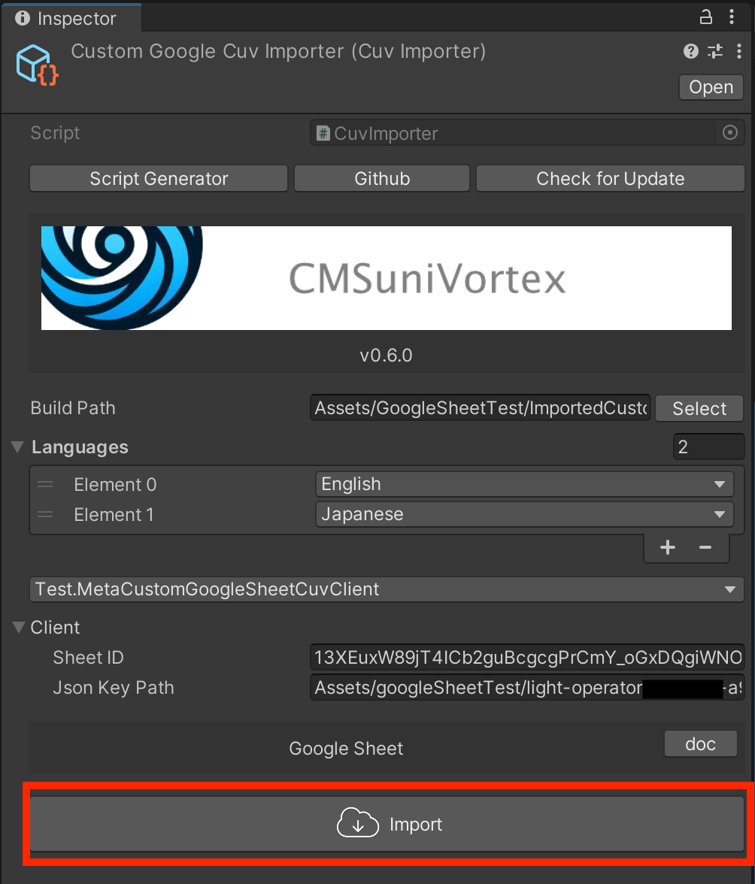

### Output

どうやって参照するかを指定します。今回は直接参照の`CustomGoogleSheetCuvOutput`を指定しました。「Output」をクリックして出力します。

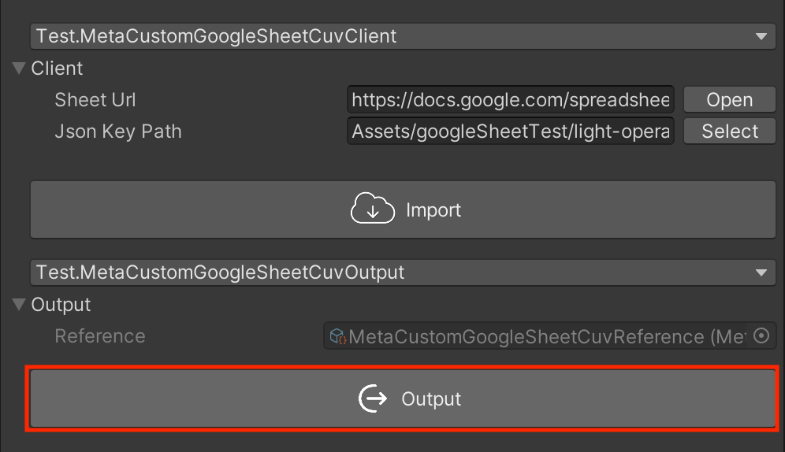

### 取得と表示

Simpleを参照してください。

### 必ずKeyを設定する
シートは1番目の`Key`を必ず設定してください。またそのキーは重複しないように注意してください。

## カスタム方法

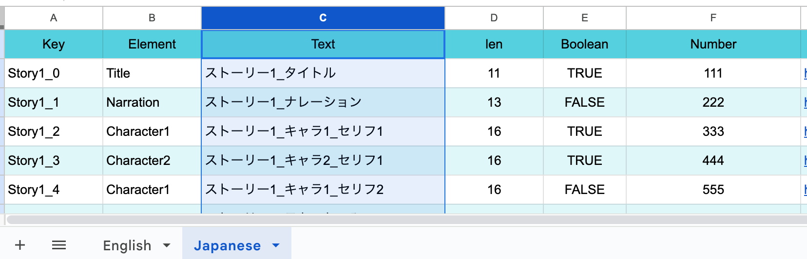

シートの'Text'列はモデルの`Text = GetString("Text");`で取得できます。

```csharp
public sealed class Meta : CustomGoogleSheetModel
{
    public ElementType Element;
    public string Text; // <--
    public bool Boolean;
    public int Number;
    public Sprite Image;
    public string Date;
    
    public enum ElementType { Title, Narration, Character1, Character2, Character3, TextOnly }

    protected override void OnDeserialize()
    {
        Element = GetEnum<ElementType>("Element");
        Text = GetString("Text"); // <--
        Boolean = GetBool("Boolean");
        Number = GetInt("Number");
        Date = GetDate("Date");
        
        LoadSprite("Image", sprite => Image = sprite);
    }
}
```

Addressable対応の`CuvClient`を選択した場合、`AssetReference`を使えます。

```csharp
using System;
using CMSuniVortex.GoogleSheet;
using UnityEngine.AddressableAssets;

[Serializable]
public sealed class MetaAddressable : CustomGoogleSheetModel
{
    public AssetReferenceSprite Sprite;
    public AssetReferenceTexture2D Texture;

    protected override void OnDeserialize()
    {
        LoadSpriteReference("Image", asset => Sprite = asset);
        LoadTextureReference("Image2", asset => Texture = asset);
    }
}
```

### 追加
追加方法を説明します。まずEnglishのシートにFloatを追加してみたいと思います。

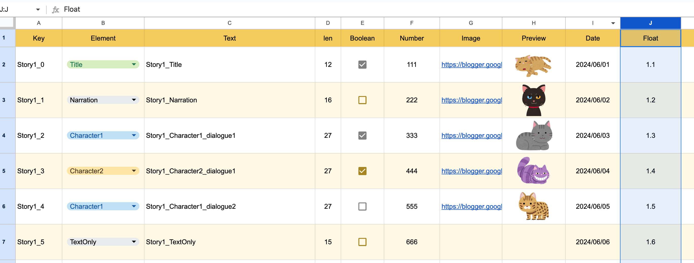

`Japanese`は、翻訳が必要なところ以外は`English`のシートをインポートすると楽です。`English`のE〜Jのセルを`IMPORTRANGE`関数で表示しています。

```javascript
// Sheet url, Sheet name + cells
=IMPORTRANGE("https://docs.google.com/spreadsheets/d/13XEuxW89jT4ICb2guBcgcgPrCmY_oGxDQgiWNOth7ww/", "English!E:J")
```

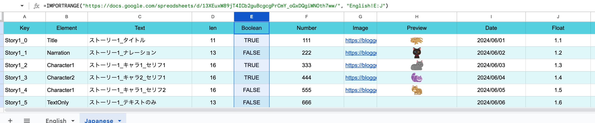

Floatを生成したモデルに追加し、デシリアライズ処理を追加します。

```csharp
public sealed class Meta : CustomGoogleSheetModel
{
    public ElementType Element;
    public string Text;
    public bool Boolean;
    public int Number;
    public Sprite Image;
    public string Date;
    public float Float; // <--
    
    public enum ElementType { Title, Narration, Character1, Character2, Character3, TextOnly }

    protected override void OnDeserialize()
    {
        Element = GetEnum<ElementType>("Element");
        Text = GetString("Text");
        Boolean = GetBool("Boolean");
        Number = GetInt("Number");
        Date = GetDate("Date");
        Float = GetFloat("Float"); // <--
        
        LoadSprite("Image", sprite => Image = sprite);
    }
}
```

追加後、インポートします。


エラー無く、下記のように追加されていれば完了です。
この要領で削除したり追加したりして自分のオリジナルのシートを作ってみてください。

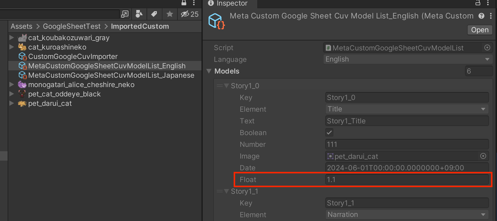

## Google API ライブラリ

データ取得に、オフィシャルのライブラリを利用しています。

[https://www.nuget.org/profiles/google-apis-packages](https://www.nuget.org/profiles/google-apis-packages)

- Google.Apis
- Google.Apis.Core
- Google.Apis.Auth
- Google.Apis.Drive.v3
- Google.Apis.Sheets.v4