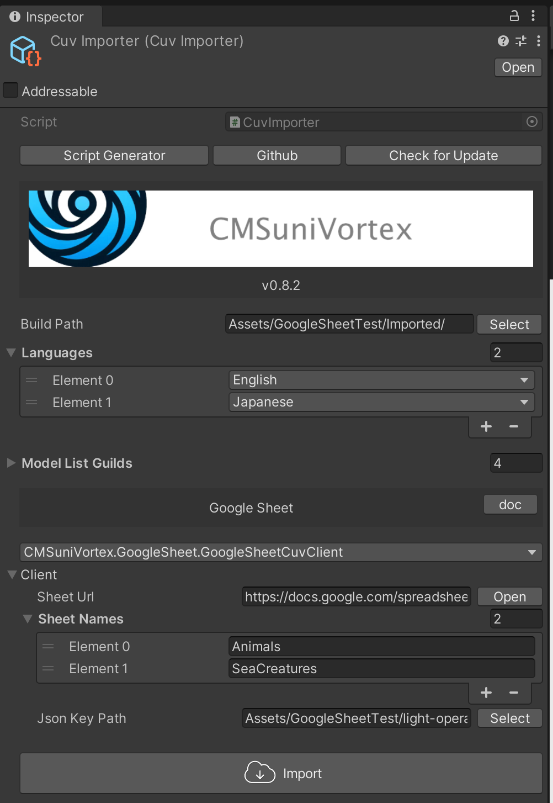

## Google Sheetに必要なもの

- [Google アカウント](https://www.google.com/intl/ja/account/about/)
- [Google Cloud アカウント](https://console.cloud.google.com/)

### 設定がまだの方は[初期設定](InitialSetupOfGoogleSheet_jp.md)から完了させてください。

## ２つのタイプを用意

用途に合わせて使ってください。

- [Simple](#simple) - Key + 言語別のテキストのみのシンプルなもの
- [Custom](#custom) - カスタムできる汎用性の高いもの

## Simple

### スプレッドシートの生成

- [スプレッドシートのサンプル](https://docs.google.com/spreadsheets/d/19DrEi35I7H8f6bcUcORGIaUK8MmeLZ-ljkh7Fkbcxtw/)を開く
- 「ファイル > コピーを作成」でコピーしてください
- コピーしたファイルに[共有設定](InitialSetupOfGoogleSheet_jp.md#スプレッドシートの共有設定)をしてください

### CuvImporterを生成

Project上を右クリックし「CMSuniVortex > create CuvImporter」から`CuvImporter`を生成します。


Clientに`CMSuniVortex.GoogleSheet.GoogleSheetCuvClient`を選択


### CuvImporterに必要情報の入力

|            | explanation                     | e.g.|
|------------|---------------------------------|-----------------------|
| Build Path | アセットを生成するパス | Assets/Generated/  |
| Languages  | 言語を指定、利用していなくても必ず1つ選択する必要があります。 | English |
| Sheet ID   | スプレッドシートのURLに含まれるID  | 19DrEi35I7H8f6bcUcORGIaUK8MmeLZ-ljkh7Fkbcxtw|
| Sheet Names   | スプレッドシートの下段タブ名 | Animals, SeaCreatures |
| Json Key Path   | サービスアカウントを保存したパス  | Assets/GoogleSheetTest/light-operator-x-x-x.json |


入力後、「Import」をクリックしてください。エラーが出ず`Build Path`に出力されていれば完了です。



## Custom

### スプレッドシートの生成

- [スプレッドシートのサンプル](https://docs.google.com/spreadsheets/d/13XEuxW89jT4ICb2guBcgcgPrCmY_oGxDQgiWNOth7ww)を開く
- 「ファイル > コピーを作成」でコピーしてください
- コピーしたファイルに[共有設定](InitialSetupOfGoogleSheet_jp.md#スプレッドシートの共有設定)をしてください

### CuvImporterを生成

Project上を右クリックし「CMSuniVortex > create CuvImporter」から`CuvImporter`を生成します。


生成したCuvImporterの「Script Generator」ボタンをクリック


### スクリプト生成

必要情報を入力して生成してください。

|                 | explanation                   | e.g.                |
|-----------------|-------------------------------|---------------------|
| Full Class Name | クラス名を指定。namespaceを指定する事も可能です。 | namespace.ClassName |
| Build Path      | コードを生成するディレクトリのパスを指定          | Assets/Models/      |


### CuvImporterに必要情報の入力

Clientに生成したClientを選択


情報を入力します。

|            | explanation                     | e.g.                                             |
|------------|---------------------------------|--------------------------------------------------|
| Build Path | アセットを生成するパス                     | Assets/Generated/                                |
| Languages  | 言語を指定、利用していなくても必ず1つ選択する必要があります。 | English                                          |
| Sheet ID   | スプレッドシートのURLに含まれるID  | 19DrEi35I7H8f6bcUcORGIaUK8MmeLZ-ljkh7Fkbcxtw     |
| Json Key Path   | サービスアカウントを保存したパス  | Assets/GoogleSheetTest/light-operator-x-x-x.json |


### インポート

インポートボタンをクリックしてインポートします。
インポート後、エラーなく`Build Path`に出力されていれば成功です。


## カスタム方法

シートの'Text'は


生成したモデルの`public string Text;`と一致します。理由は`Text = GetString("Text");`の`"Text"`とスプレッドシートの1番目のセルの名称が一致するからです。

```csharp
public sealed class Meta : CustomGoogleSheetModel
{
    public ElementType Element;
    public string Text;
    public bool Boolean;
    public int Number;
    public Sprite Image;
    public string Date;
    
    public enum ElementType { Title, Narration, Character1, Character2, Character3, TextOnly }

    protected override void OnDeserialize()
    {
        Element = GetEnum<ElementType>("Element");
        Text = GetString("Text"); // <--
        Boolean = GetBool("Boolean");
        Number = GetInt("Number");
        Date = GetDate("Date");
        
        LoadSprite("Image", sprite => Image = sprite);
    }
}
```

### 追加
では、追加方法を説明します。まずEnglishのシートにFloatを追加してみたいと思います。


`Japanese`は、翻訳が必要なところ以外は`English`のシートをインポートすると楽です。`English`のE〜Jのセルを`IMPORTRANGE`関数で表示しています。

```javascript
// Sheet url, Sheet name + cells
=IMPORTRANGE("https://docs.google.com/spreadsheets/d/13XEuxW89jT4ICb2guBcgcgPrCmY_oGxDQgiWNOth7ww/", "English!E:J")
```


Floatを生成したモデルに追加し、デシリアライズ処理を追加します。

```csharp
public sealed class Meta : CustomGoogleSheetModel
{
    public ElementType Element;
    public string Text;
    public bool Boolean;
    public int Number;
    public Sprite Image;
    public string Date;
    public float Float; // <--
    
    public enum ElementType { Title, Narration, Character1, Character2, Character3, TextOnly }

    protected override void OnDeserialize()
    {
        Element = GetEnum<ElementType>("Element");
        Text = GetString("Text");
        Boolean = GetBool("Boolean");
        Number = GetInt("Number");
        Date = GetDate("Date");
        Float = GetFloat("Float"); // <--
        
        LoadSprite("Image", sprite => Image = sprite);
    }
}
```

追加後、インポートします。


エラー無く、下記のように追加されていれば完了です。
この要領で削除したり追加したりして自分のオリジナルのシートを作ってみてください。

