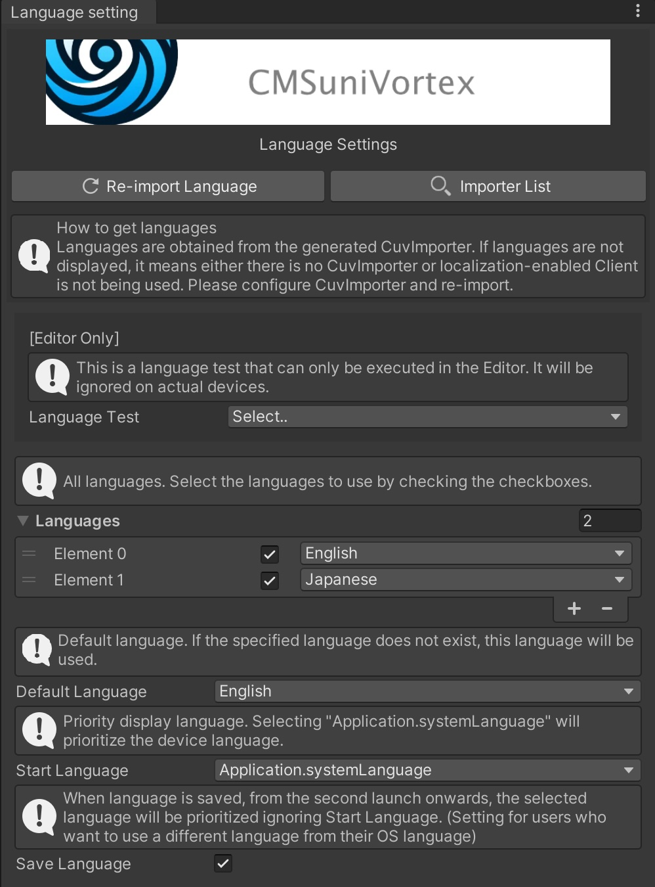

[日本語](Localization_jp.md)

> [!IMPORTANT]
> **Version 2.X includes enhanced localization features but contains breaking changes. Be sure to backup before
upgrading.**

## Using Localization - Script Generation

To use localization, check `Use localization` in Script Generator to generate scripts.

`Window > CMSuniVortex > open Script Generator`


## Using Localization - CuvImporter Settings

Generate and configure CuvImporter via `Window > CMSuniVortex > create CuvImporter`.

- ① Select the Client generated by Script Generator
- ② Select Output. Selecting Output enables localization functionality.

After configuring, click Import button to import and Output button to output.


For detailed settings information, click the `doc` button in the generated CuvImporter.


### Is Addressables Recommended?

Yes. Addressables is recommended since it only loads necessary data, saving memory. It's especially recommended when
dealing with many `Sprites` or `Textures`.  
However, it requires some knowledge to use. We recommend learning about it before implementation.

## Displaying Data

Using components makes displaying data easier. Specifically, use `CuvAddressableLocalized<T>` for Addressables, and
`CuvLocalized<T>` for others. Specify the Reference class to pass to `T` as shown below. The class passed to
OnChangeLanguage is the Model class. For class names, refer to your generated scripts.

```csharp
using CMSuniVortex;

public abstract class CuvAddressableLocalizedTest : CuvAddressableLocalized<MetaLocalizeAddressableCustomGoogleSheetCuvAddressableReference>
{
    protected abstract void OnChangeLanguage(MetaLocalizeAddressable catDetails);
    
    protected override void OnChangeLanguage(MetaLocalizeAddressableCustomGoogleSheetCuvAddressableReference reference, string key)
    {
        if (reference.TryGetByKey(key, out var model))
        {
            OnChangeLanguage(model);
        }
    }
}
```

Then, inherit from the class generated above to use it.  
Below is an example of displaying a `Sprite` in an `Image`.

The Key corresponds to the Key name set in the Google Sheet.


```csharp
using UnityEngine;
using UnityEngine.AddressableAssets;
using UnityEngine.ResourceManagement.AsyncOperations;
using UnityEngine.UI;

[RequireComponent(typeof(Image))]
public sealed class CuvAddressableLocalizedImageTest : CuvAddressableLocalizedTest
{
    [SerializeField] Image _image;

    AsyncOperationHandle<Sprite> _handle;
    
    protected override async void OnChangeLanguage(MetaLocalizeAddressable model)
    {
        _handle = Addressables.LoadAssetAsync<Sprite>(model.Image);
        await _handle.Task;
        if (_handle.Status == AsyncOperationStatus.Succeeded)
        {
            _image.sprite = _handle.Result;
        }
        else if (_handle.Status == AsyncOperationStatus.Failed)
        {
            Debug.LogError(_handle.OperationException);
        }
    }

    void OnDestroy()
    {
        if (_handle.IsValid())
        {
            Addressables.Release(_handle);
        }
    }

    protected override void Reset()
    {
        base.Reset();
        _image = GetComponent<Image>();
    }
}
```

## Switching Languages

The simplest method is to set `CuvLanguageDropDown` to a Dropdown.
For cases other than Dropdown, create an original class that inherits from `CuvLanguages`.
Below is the implementation for Dropdown.

```csharp

using System.Collections.Generic;
using UnityEngine;
using UnityEngine.UI;

namespace CMSuniVortex
{
    public sealed class CuvLanguageDropDown : CuvLanguages
    {
        [SerializeField] Dropdown _dropdown;

        protected override void OnInitialized()
        {
            var options = new List<Dropdown.OptionData>();
            foreach (var language in Languages)
            {
                var languageString = language.ToString();
                var data = new Dropdown.OptionData(languageString);
                options.Add(data);
            }
            _dropdown.options = options;
            _dropdown.value = GetLanguageIndex(ActiveLanguage);
            _dropdown.onValueChanged.AddListener(OnValueChanged);
        }

        void OnValueChanged(int index)
        {
            var language = GetLanguageAt(index);
            ChangeLanguage(language);
        }

        void Reset() => _dropdown = GetComponent<Dropdown>();
    }
}
```

## Language Configuration

The languages used in language settings are retrieved from existing data (CuvImporter). They won't be displayed if no
language is selected. Localization will work without configuration, so set languages as needed after creating language
data.

Without language configuration, the following settings apply:

- **Languages:** All languages are targeted, retrieved from all CuvImporters
- **Default Language:** Uses the first language set in CuvImporter as default
- **Start Language:** Uses the device language
- **Save Language:** When a language is selected, it is saved and used in subsequent sessions

`Window > CMSuniVortex > open Language Setting`

