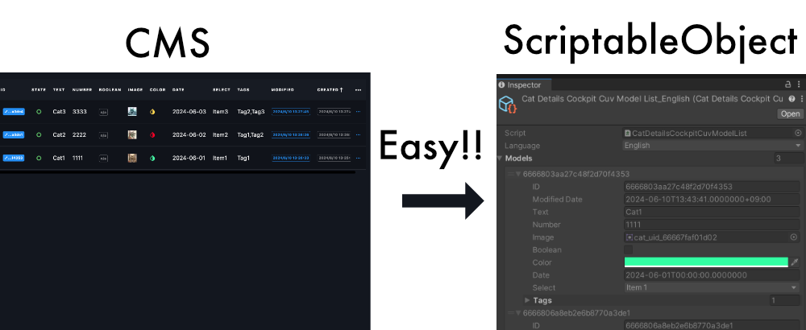
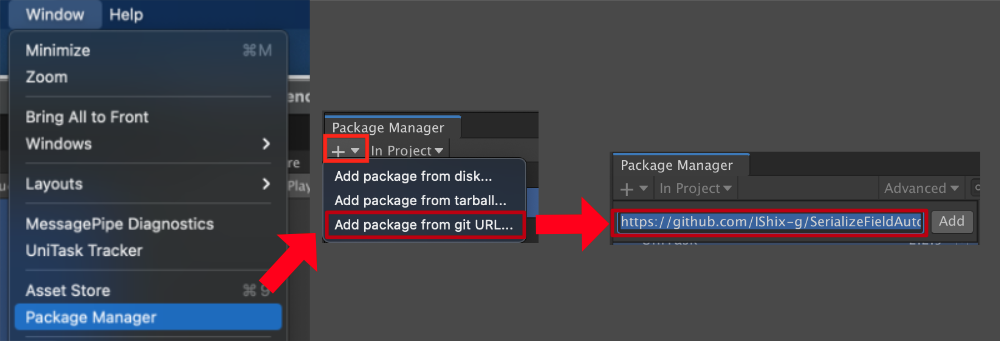
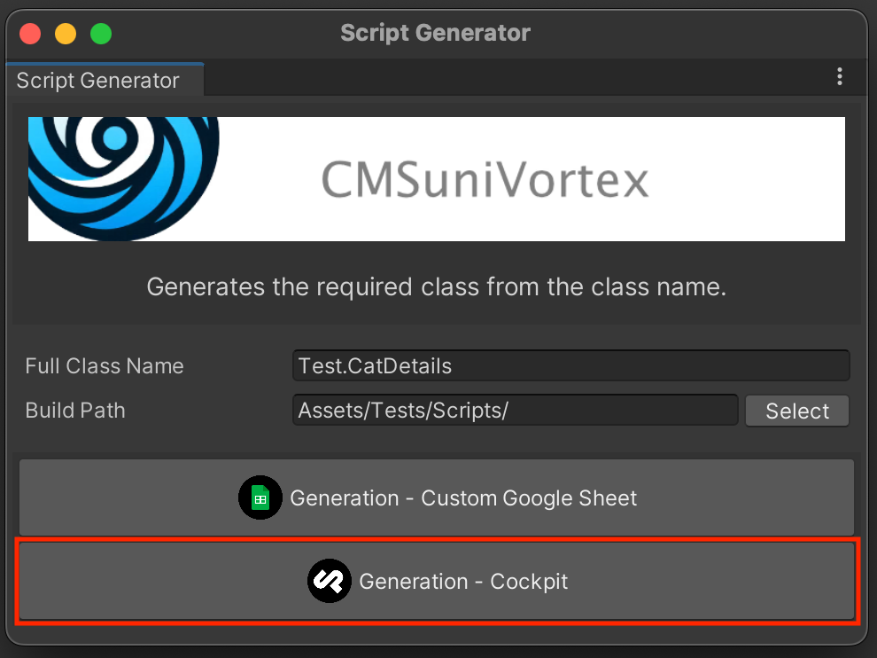
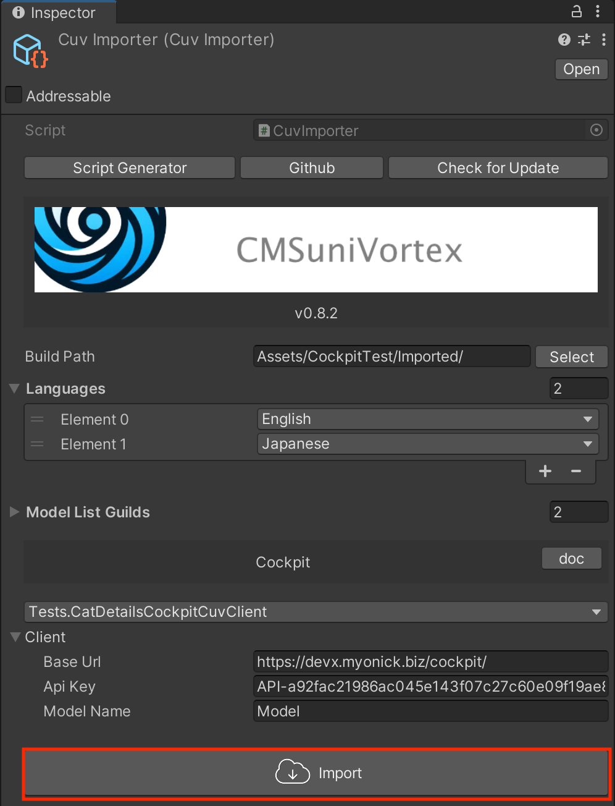
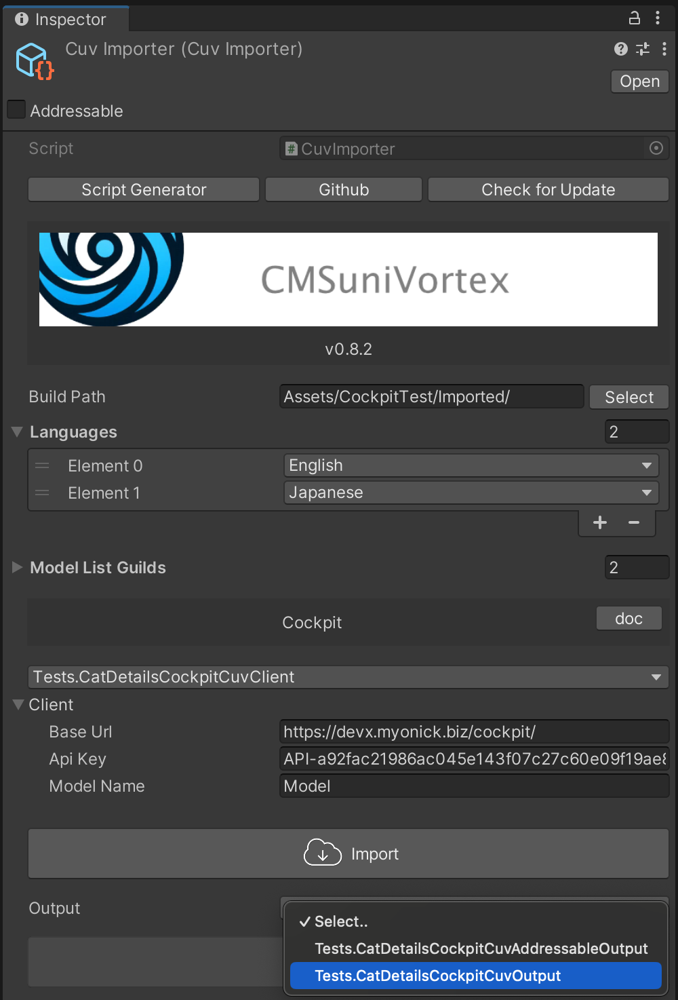
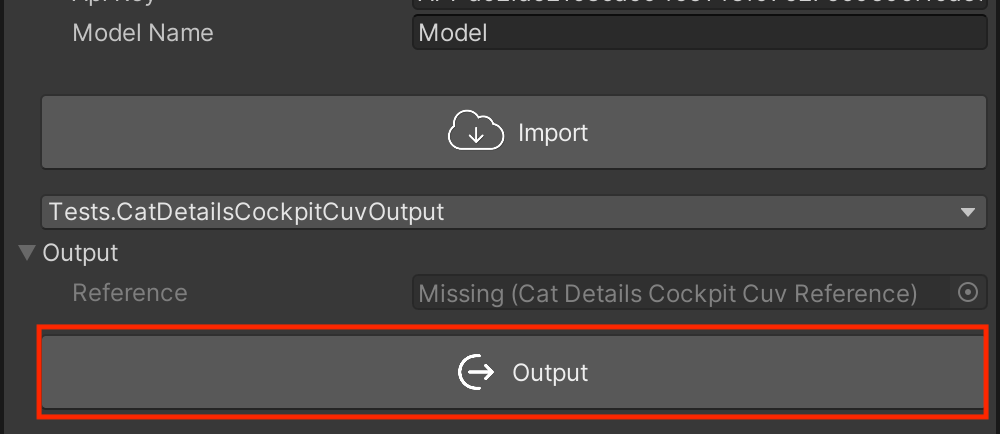
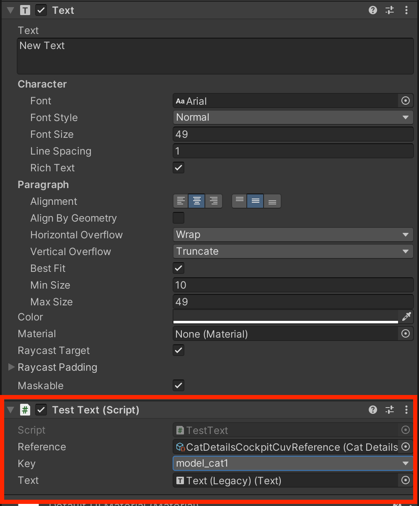

CMSのデータを `ScriptableObject` に簡単にインポートできるプラグイン



## このプラグインを使う理由

このプラグインは **「簡単に入力でき、最高なパフォーマンスを発揮する」** というコンセプトを持っています。

### 入力の簡単さ

入力といえばCMS。CMSには **簡単にストレス無く入力できる** ノウハウが詰まっています。また、どこからでも更新できる気軽さもあります。

### パフォーマンスの良いデータ

`ScriptableObject`はUnityで扱うように最適化されたデータ形式です。パフォーマンスに優れています。

しかしながら、これら2つは一見無関係なものに見えるかもしれません。しかしCMSと`ScriptableObject`を繋ぎ合わせてくれるのがCMSuniVortex(シーエムエス・ユニ・ボルテックス)です。 これは単なるプラグインではなく、効率性とパフォーマンスを追求した結果が生み出した解決策です。

## 対応するCMS

- [Cockpit](IntegrationWithCockpit_jp.md)
- [Google Sheets](IntegrationWithGoogleSheet_jp.md)

## 対応する参照方法

出力したデータの参照方法を指定できます。

- 直接参照
- [Addressables](https://docs.unity3d.com/Packages/com.unity.addressables@1.19/manual/index.html)で参照

## Unity Version
Unity 2021.3.x higher

## Getting started

### Install via git URL
「Window > Package Manager > Add package from git URL...」にUrlを追加してください。

URL : `https://github.com/IShix-g/CMSuniVortex.git?path=Packages/CMSuniVortex`



## Quick Start

### CuvImporterの作成

Project上を右クリックし「Create > CMSuniVortex > create CuvImporter」から`CuvImporter`を生成します。


### コードの生成

生成した`CuvImporter`の「Script Generator」ボタンをクリック


必要情報を入力しコードを生成します。今回は、Cockpitのコードを生成します。



|                 | explanation                   | e.g.                |
|-----------------|-------------------------------|---------------------|
| Full Class Name | クラス名を指定。namespaceを指定する事も可能です。 | namespace.ClassName |
| Build Path      | コードを生成するディレクトリのパスを指定          | Assets/Models/      |


### CuvImporterに必要情報の入力

生成後、CuvImporterに戻り必要情報を入力します。Clientに先ほど生成したスクリプトを指定します。今回は、直接参照用の`CatDetailsCockpitCuvClient`を選択しました。[Addressables](https://docs.unity3d.com/Packages/com.unity.addressables@1.19/manual/index.html)を利用する場合は、ひとつ上の`AddressableClient`を選択します。

**出力されたClientの命名ルール :** 「コード生成時に指定したFull class name」 + 「CMS name」 + 「Output name」 + 「CuvClient」

|            | explanation                        | e.g.           |
|------------|------------------------------------|----------------|
| Build Path | データの出力先ディレクトリを指定            | Assets/Models/ |
| Languages  | 言語を指定、利用していなくても必ず1つ選択する必要があります。    | English|
| Clint      | 直接参照またはAddressablesなど任意のClientを指定します。 | Test.ClassNameCockpitCuvClient|
| Output      | Clientで出力したデータをどのように参照するかを決定します。 | Test.ClassNameCockpitCuvOutput|


#### Cockpit Client

|            | explanation                        | e.g.           |
|------------|------------------------------------|----------------|
| Base Url | CockpitをインストールしたURL            | https://xxx.xxx.com/cockpit/ |
| Api Key  | Cockpitの管理画面で取得するApi Key    | English|
| Model Name      | Cockpitの管理画面で設定したモデル名 | Model |

### Cockpit CMSテスト
実際にCockpit CMSを使ったテストが可能です。下記ご利用ください。

|            | value                                        |
|------------|----------------------------------------------|
| Base Url   | [https://devx.myonick.biz/cockpit/](https://devx.myonick.biz/cockpit/)|
| Api Key    | API-a92fac21986ac045e143f07c27c60e09f19ae856 |
| Model Name | Model                                        |

#### ログイン情報

閲覧権限ですが、実際にログインして管理画面を見る事ができます。

|     | value                                                                  |
|-----|------------------------------------------------------------------------|
| URL | [https://devx.myonick.biz/cockpit/](https://devx.myonick.biz/cockpit/) |
| ID  | guest                                                                  |
| PW  | guest                                                                  |

#### Cockpit テストサーバーの注意点

- 利用の際は節度をもった利用をお願いします。
- 頻繁にアクセスしすぎない。
- 連続したImportをしない。
- 無料のレンタルサーバーを利用している為、広告が表示されますが私は一切関与していません。
- 不適切なアクセスを発見次第、予告なく停止しますのでご了承ください。

### インポートの開始

入力後インポートをクリックすると指定したディレクトリにデータが生成されます。




### Outputの指定

インポートしたデータをどのように参照するかを決定します。今回は直接参照の`CatDetailsCockpitCuvOutput`を選択します。



選択後、Outputをクリックし生成します。



### データの取得とテキストの表示

生成した`CatDetailsCockpitCuvReference`から`GetList()`を使用してデータを取得できます。用意している`CuvComponent`を使用すると下記のように取得できます。



Referenceのインスタンスと、インスペクタで設定したKeyが渡りますので`TryGetByKey`を使って取得します。

```csharp
using UnityEngine;
using UnityEngine.UI;
using CMSuniVortex.Compornents;

public sealed class TestText : CuvComponent<CatDetailsCockpitCuvReference>
{
    [SerializeField] Text _text;
    
    protected override void OnChangeLanguage(CatDetailsCockpitCuvReference reference, string key)
    {
        if (reference.GetList().TryGetByKey(key, out var model))
        {
            _text.text = model.Text;
        }
    }
}
```

## Cockpitの設定

設定方法などは詳細は[こちら](InitialSetupOfGoogleSheet_jp.md)をごらんください。


## 各クラスの役割

プラグインを構成する代表的なクラスは[こちら](RelationshipsBetweenClasses_jp.md)より確認できます。

## なぜこのプラグインを作ろうと思ったのか？

私が、このプラグインを開発するきっかけになったのがパフォーマンステストです。 データをダウンロードし、表示するには大まかに以下の3つの方法があります。

### 1. Addressable

#### メリット

`ScriptableObject`や`Sprite`を使う事で、デシリアライズやデータ変換が必要無くパフォーマンスが良い

#### 懸念点

Unityで書き出す必要があるのでプログラマーが必要。またはそれなりの変換システムを構築する必要がある

<details><summary>テストコード</summary>

```csharp

using UnityEngine;
using UnityEngine.UI;
using UnityEngine.AddressableAssets;
using UnityEngine.ResourceManagement.AsyncOperations;
using UnityEngine.Profiling;

public sealed class AddressableTest : MonoBehaviour
{
    [SerializeField] Image _image;
    [SerializeField] Text _text;
    [SerializeField] Button _loadButton;
    [SerializeField] Button _unloadButton;

    AsyncOperationHandle<AddressableData> _handle;
    
    void Start()
    {
        _loadButton.onClick.AddListener(OnLoadButtonClicked);
        _unloadButton.onClick.AddListener(OnUnloadButtonClicked);
        _loadButton.interactable = true;
        _unloadButton.interactable = false;
    }

    void OnDestroy() => Unload();

    async void OnLoadButtonClicked()
    {
        _loadButton.interactable = false;
        _unloadButton.interactable = true;
        
        Profiler.BeginSample("AddressableTestProfile1");
        _handle = Addressables.LoadAssetAsync<AddressableData>("AddressableData");
        Profiler.EndSample();
        await _handle.Task;
        
        Profiler.BeginSample("AddressableTestProfile2");
        var obj = _handle.Result;
        _image.sprite = obj.Image;
        _text.text = obj.GetText();
        Profiler.EndSample();
    }

    void OnUnloadButtonClicked()
    {
        Unload();
        _loadButton.interactable = true;
        _unloadButton.interactable = false;
    }

    void Unload()
    {
        if (_image != default)
        {
            _image.sprite = default;
        }
        if (_text != default)
        {
            _text.text = default;
        }
        
        if (_handle.IsValid())
        {
            Addressables.Release(_handle);
        }
    }
}

[CreateAssetMenu(fileName = "AddressableData", menuName = "ScriptableObject/AddressableData", order = 0)]
public sealed class AddressableData : ScriptableObject
{
    public int ID;
    public string Title;
    public string Contents;
    public Sprite Image;

    public string GetText() => "ID:" + ID + "\nTitle:" + Title + "\nContents:" + Contents;
}
```
</details>

### 2. WebView

[Cross Platform Essential Kit](https://assetstore.unity.com/packages/tools/integration/cross-platform-native-plugins-essential-kit-mobile-ios-android-140111)のWebViewを使用

#### メリット

- WEBページとアプリで兼用できる
- リリース後もレイアウトが自由

#### 懸念点

- メモリ使用量が心配

<details><summary>テストコード</summary>

```csharp

using UnityEngine;
using UnityEngine.UI;
using UnityEngine.Profiling;
using VoxelBusters.CoreLibrary;
using VoxelBusters.EssentialKit;

public sealed class WebViewTest : MonoBehaviour
{
    const string url = "https://xxx.xxxx.com/webview/";
    
    [SerializeField] Button _openButton;
    [SerializeField] Button _closeButton;

    WebView _webView;

    void Start()
    {
        _openButton.onClick.AddListener(ClickOpenButton);
        _closeButton.onClick.AddListener(ClickCloseButton);
        _openButton.interactable = true;
        _closeButton.interactable = false;
    }

    void OnEnable()
    {
        WebView.OnShow += OnWebViewShow;
        WebView.OnHide += OnWebViewHide;
    }
    
    void OnDisable()
    {
        WebView.OnShow -= OnWebViewShow;
        WebView.OnHide -= OnWebViewHide;
    }
    
    void ClickOpenButton()
    {
        _openButton.interactable = false;
        
        Profiler.BeginSample("WebViewTestProfile");
        _webView = WebView.CreateInstance();
        _webView.SetNormalizedFrame(new Rect(0.1f, 0.2f, 0.8f, 0.6f));
        _webView.LoadURL(URLString.URLWithPath(url));
        _webView.Show();
        Profiler.EndSample();
    }
    
    void ClickCloseButton() => _webView.Hide();
    
    void OnWebViewShow(WebView view) => _closeButton.interactable = true;

    void OnWebViewHide(WebView view)
    {
        _openButton.interactable = true;
        _closeButton.interactable = false;
    }
}
```

Webページ
```html
<!DOCTYPE html>
<html lang="ja">
<head>
    <meta charset="utf-8">
    <title>Test</title>
    <meta name="viewport" content="width=device-width,initial-scale=1.0">
    <meta name="format-detection" content="telephone=no,email=no,address=no">
    <style type="text/css">
        img{
            max-width: 100%;
        }
    </style>
</head>
<body>

<div id="myData">
    <h2 id="title"></h2>
    <p id="contents"></p>
    
</div>

<script src="https://code.jquery.com/jquery-1.12.4.min.js"></script>

<script>
    $.ajax({
        url: 'getModel.php',
        dataType: 'json',
        success: function(data) {
            $('#title').text(data.Title);
            $('#contents').text(data.Contents);
            $('#image').attr('src', data.Image);
        },
        error: function (request, status, error) {
            console.log("Error: Could not fetch data");
        }
    });
</script>
</body>
</html>
```

データを取得するAPI
```php
<?php

class Model {
    public $Id;
    public $Title;
    public $Contents;
    public $Image;
}

mb_language("uni");
mb_internal_encoding("UTF-8");
header('Content-type: application/json');

$model = new Model();
$model->Id = 2222;
$model->Title = '猫　ねこ';
$model->Contents = '猫は、古代のミアキスと言う豹のような大きな動物が起源と言われています。 今から４０００～５０００年前にエジプトから発生し、住み良い環境を求め分化して中東に行きました。';
$model->Image = 'https://xxx.xxxx.com/webview/cat.jpg';
echo json_encode( $model );
```
</details>

### [テスト3] Json

[UnityWebRequest](https://docs.unity3d.com/ja/2021.3/ScriptReference/Networking.UnityWebRequest.html)でサーバーから取得したJsonを変換して表示。

#### メリット
- WEBとアプリで兼用できる
- 初期化以外はWebViewより軽そう

#### 懸念点
- jsonのデシリアライズやSpriteの生成が必要なので初期化コストが心配
- データをキャッシュしないのでキャッシュする機構を自身で用意する必要がある

<details><summary>テストコード</summary>

※データを取得するAPIはWebViewで使ったものを利用しているので省略

```csharp

using System;
using System.Collections;
using UnityEngine;
using UnityEngine.UI;
using UnityEngine.Networking;
using UnityEngine.Profiling;

public sealed class JsonTest : MonoBehaviour
{
    const string apiUrl = "https://xxx.xxxx.com/webview/getModel.php";
    
    [SerializeField] Image _image;
    [SerializeField] Text _text;
    [SerializeField] Button _loadButton;
    [SerializeField] Button _unloadButton;
    
    [Serializable]
    sealed class Model
    {
        public int ID;
        public string Title;
        public string Contents;
        public string Image;
        
        public string GetText() => "ID:" + ID + "\nTitle:" + Title + "\nContents:" + Contents;
    }

    void Start()
    {
        _loadButton.onClick.AddListener(OnLoadButtonClicked);
        _unloadButton.onClick.AddListener(OnUnloadButtonClicked);
        _loadButton.interactable = true;
        _unloadButton.interactable = false;
    }

    void OnDestroy() => Unload();
        
    void OnLoadButtonClicked()
    {
        _loadButton.interactable = false;
        _unloadButton.interactable = false;
        
        StartCoroutine(LoadCo((model, sprite) =>
        {
            _text.text = model.GetText();
            _image.sprite = sprite;
            Profiler.EndSample();
            _unloadButton.interactable = true;
        }));
    }
    
    IEnumerator LoadCo(Action<Model, Sprite> onSuccess)
    {
        Profiler.BeginSample("JsonTestProfile1");
        using var request = UnityWebRequest.Get(apiUrl);
        Profiler.EndSample();
        yield return request.SendWebRequest();
        
        if (request.result == UnityWebRequest.Result.Success)
        {
            Profiler.BeginSample("JsonTestProfile2");
            var model = JsonUtility.FromJson<Model>(request.downloadHandler.text);
            using var imgRequest = UnityWebRequestTexture.GetTexture(model.Image);
            Profiler.EndSample();
            yield return imgRequest.SendWebRequest();
            
            if (imgRequest.result == UnityWebRequest.Result.Success)
            {
                Profiler.BeginSample("JsonTestProfile3");
                var texture = ((DownloadHandlerTexture)imgRequest.downloadHandler).texture;
                var sprite = Sprite.Create(
                    texture, 
                    new Rect(0, 0, texture.width, texture.height), 
                    new Vector2(0.5f, 0.5f));
                
                onSuccess?.Invoke(model, sprite);
            }
            else
            {
                Debug.LogError(imgRequest.error);
            }
        }
        else
        {
            Debug.LogError(request.error);
        }
    }
    
    void OnUnloadButtonClicked()
    {
        Unload();
        _loadButton.interactable = true;
        _unloadButton.interactable = false;
    }

    void Unload()
    {
        if (_image != default
            && _image.sprite != default)
        {
            var tex = _image.sprite.texture;
            _image.sprite = null;
            DestroyImmediate(tex);
            Resources.UnloadUnusedAssets();
        }
        if (_text != default)
        {
            _text.text = default;
        }
    }
}
```
</details>

### 計測結果からわかった事

このテストから下記の事がわかりました。

- Addressableが一番パフォーマンスが良い。
- WebViewはAndroidで無視できないメモリを使う。※すべてのメモリを解放できない可能性あり
- Jsonは画像が多いと無視できない初期化コストが発生する。(テストでは画像1枚のみ)

この結果からパフォーマンスの良いAddressableを使いつつ、デメリットを解消する為に気軽に更新できるCMSから入力できるようにしたいと思いこのプラグインを開発しました。

#### iOS : iPhone SE2 17.5.1

|  | GC Alloc | Time | Size |
|---|:--|:--|---|
| Addressables | 3.2KB | 0.24ms | 1.1MB |
| WebView | 22.9KB | 0.52ms | 2MB |
| Json | 15KB | 3.75ms | 2.3MB |

#### Android : Galaxy S10 Android11

|  | GC Alloc | Time | Size |
|---|:--|:--|---|
| Addressables | 3.1KB | 0.24ms | 9MB |
| WebView | 31.8KB | 0.56ms | 70MB |
| Json | 4.3KB | 1.18ms | 9.7MB |