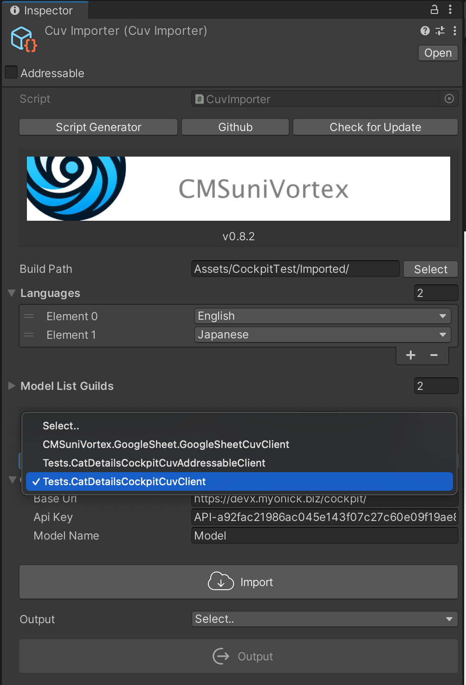
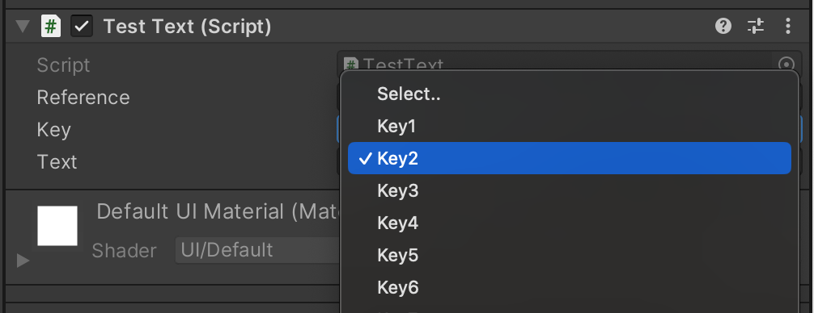
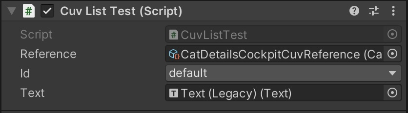
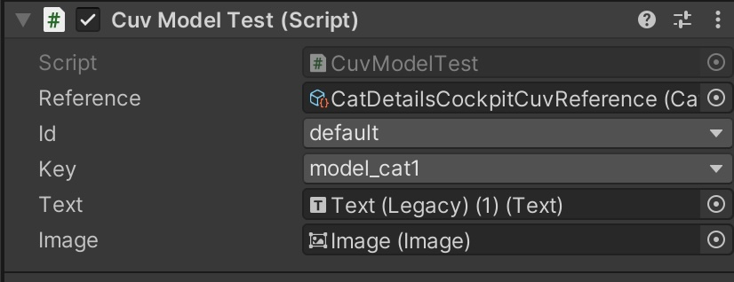
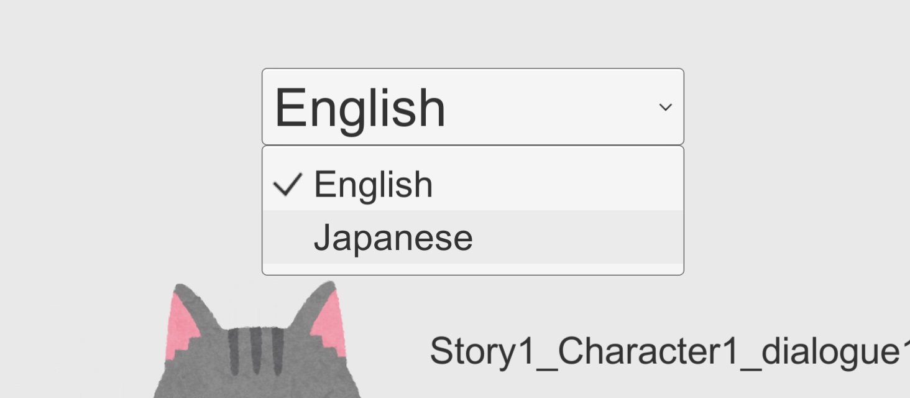
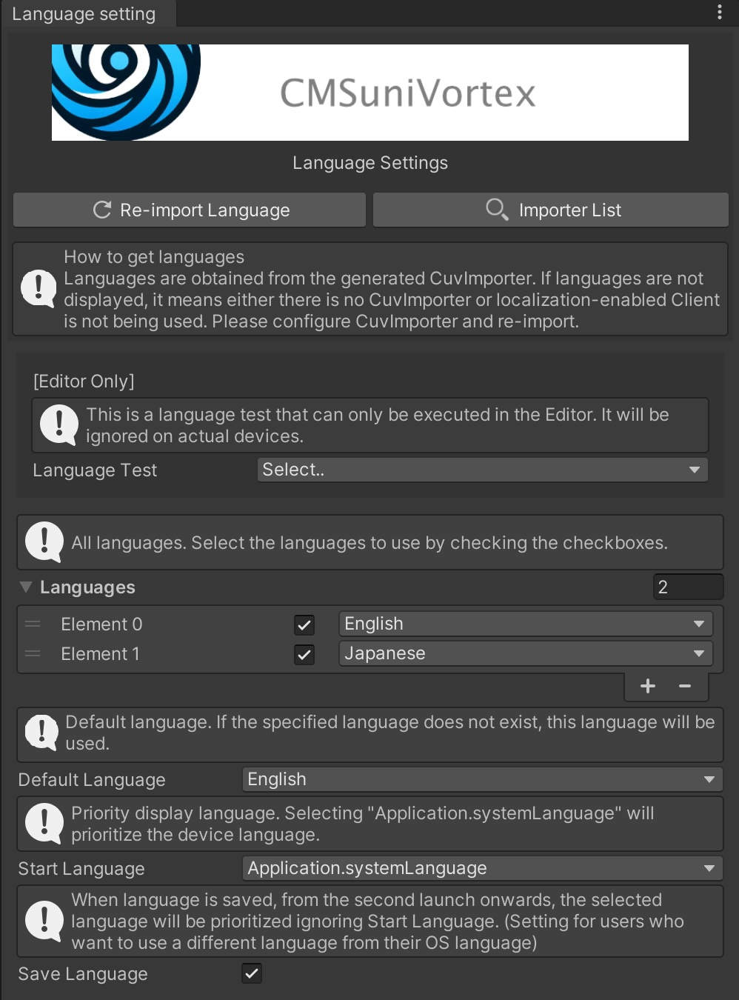

[日本語](RelationshipsBetweenClasses_jp.md)

## Role of each class

### [CuvImporter](https://github.com/IShix-g/CMSuniVortex/blob/main/Packages/CMSuniVortex/Runtime/CuvImporter.cs)

Manages CMS imports. Saves necessary states.

#### Content being saved

- Build destination path
- Target languages (array) 
- Currently used `CuvClient`



### [CuvClient](https://github.com/IShix-g/CMSuniVortex/blob/main/Packages/CMSuniVortex/Runtime/CuvClient.cs)

Determines which CMS to use and which model to employ. Once implemented, it shows up in the dropdown of `CuvImporter`.

#### CMS types

- Cockpit CMS
- Google Sheets

#### File reference method

- Direct reference
- Reference from [Addressables](https://docs.unity3d.com/Packages/com.unity.addressables@1.19/manual/index.html)

### Attributes used in CuvClient

#### `[IgnoreImporter]` attribute
When specified, it will not be displayed in the dropdown list of `CuvImporter`.

```csharp
[IgnoreImporter] // <--
public sealed class TestCockpitCuvClient : CockpitCuvClient<TestCockpitModel, TestCockpitCuvModelList>
{
    protected override JsonConverter<TestCockpitModel> CreateConverter()
        => new CuvModelConverter<TestCockpitModel>();
}

```

#### `[CuvDisplayName("Name")]` attribute
When specified, it allows you to change the name displayed in the dropdown list of `CuvImporter`.

```csharp
[CuvDisplayName("YourCustomName")] // <--
public sealed class TestCockpitCuvClient : CockpitCuvClient<TestCockpitModel, TestCockpitCuvModelList>
{
    protected override JsonConverter<TestCockpitModel> CreateConverter()
        => new CuvModelConverter<TestCockpitModel>();
}

```

### [CuvModelList](https://github.com/IShix-g/CMSuniVortex/blob/main/Packages/CMSuniVortex/Runtime/CuvModelList.cs)

Generated by `CuvClient`. Saves data in target language-specific `ScriptableObject`. The model is stored in arrays and can be obtained with a `Key`.

### [ICuvModel](https://github.com/IShix-g/CMSuniVortex/blob/main/Packages/CMSuniVortex/Runtime/ICuvModel.cs)

Model. Corresponds to one article of data in CMS.

### [ICuvOutput](https://github.com/IShix-g/CMSuniVortex/blob/main/Packages/CMSuniVortex/Runtime/ICuvOutput.cs)

Determines how to reference the `CuvModelList` and creates a `CuvReference`. Once implemented, it shows up in the dropdown of `CuvImporter`.

#### Types

- Direct reference
- Reference from [Addressables](https://docs.unity3d.com/Packages/com.unity.addressables@1.19/manual/index.html)

### [CuvReference](https://github.com/IShix-g/CMSuniVortex/blob/main/Packages/CMSuniVortex/Runtime/CuvReference.cs)

A `ScriptableObject` that manages references to the `CuvModelList<T>` stored by language. The user extracts data from here.

## Component

### `CuvModelKey("ref")` Attribute

Although it's fine to use the created `CuvReference` directly, it's convenient to use this component because it displays a drop-down list of the configured `Key`.



Pass the field name of the `CuvReference` you want to reference as an argument.

```csharp
public abstract class Test : MonoBehaviour
{
    [SerializeField] GoogleSheetCuvReference _reference;
    [SerializeField, CuvModelKey("_reference")] string _key;

```

### CuvLocalized

A localization class that wraps the `CuvModelKey` attribute to make it easier to use.

```csharp
using CMSuniVortex;
using CMSuniVortex.GoogleSheet;
using UnityEngine;
using UnityEngine.UI;

public sealed class TestText : CuvLocalized<GoogleSheetCuvReference>
{
    [SerializeField] Text _text;

    protected override void OnChangeLanguage(GoogleSheetCuvReference reference, string key)
    {
        if (reference.TryGetByKey(key, out var model))
        {
            _text.text = model.Text;
        }
    }
}
```

### CuvAddressableLocalized

This is an asynchronous version of `CuvLocalized`.

```csharp
using CMSuniVortex;
using CMSuniVortex.GoogleSheet;
using UnityEngine;
using UnityEngine.UI;

public sealed class TestText : CuvAddressableLocalized<GoogleSheetCuvReference>
{
    [SerializeField] Text _text;

    protected override void OnChangeLanguage(GoogleSheetCuvReference reference, string key)
    {
        if (reference.TryGetByKey(key, out var model))
        {
            _text.text = model.Text;
        }
    }
}
```

### SetParam

You can embed parameters by enclosing them with `{}`.

- Text: `You have earned {number} coins.`
- Display: `You have earned 5 coins.`

```csharp
using UnityEngine;
using UnityEngine.UI;
using CMSuniVortex;
using Tests;

public class CuvListTest : CuvList<CatDetails, CatDetailsCockpitCuvReference>
{
    [SerializeField] Text _text;
    
    void Start()
    {
        Debug.Log("CuvId: " + List.CuvId);
        _text.text = List.CuvId;
    }
}
```



### CuvModel

This adds the ability to specify a Key to the functionality of `CuvList`.

```csharp

using UnityEngine;
using UnityEngine.UI;
using CMSuniVortex;
using Tests;

    public sealed class CuvModelTest : CuvModel<CatDetails, CatDetailsCockpitCuvReference>
    {
        [SerializeField] Text _text;
        [SerializeField] Image _image;

        void Start()
        {
            Debug.Log("ModelId: " + Model.Key);
            _text.text = Model.Text;
            _image.sprite = Model.Image;
        }
    }
```



### CuvLanguages

You can get a list of available languages and the current language. Here is an example implementation of a DropDown:

```csharp

using System.Collections.Generic;
using UnityEngine;
using UnityEngine.UI;

namespace CMSuniVortex
{
    public sealed class CuvLanguageDropDown : CuvLanguages
    {
        [SerializeField] Dropdown _dropdown;

        protected override void OnInitialized()
        {
            var options = new List<Dropdown.OptionData>();
            foreach (var language in Languages)
            {
                var languageString = language.ToString();
                var data = new Dropdown.OptionData(languageString);
                options.Add(data);
            }
            _dropdown.options = options;
            _dropdown.value = GetLanguageIndex(ActiveLanguage);
            _dropdown.onValueChanged.AddListener(OnValueChanged);
        }

        void OnValueChanged(int index)
        {
            var language = GetLanguageAt(index);
            ChangeLanguage(language);
        }

        void Reset() => _dropdown = GetComponent<Dropdown>();
    }
}
```

You can display a language selection screen like the one below in your game.



### CuvLanguageSwitcher

The base class that holds the language list and current language. `CuvLanguages` is a wrapper class for this.

### CuvLanguageSettings

Language settings. For details, please see [here](Localization.md).

`Window > CMSuniVortex > open Language Setting`

