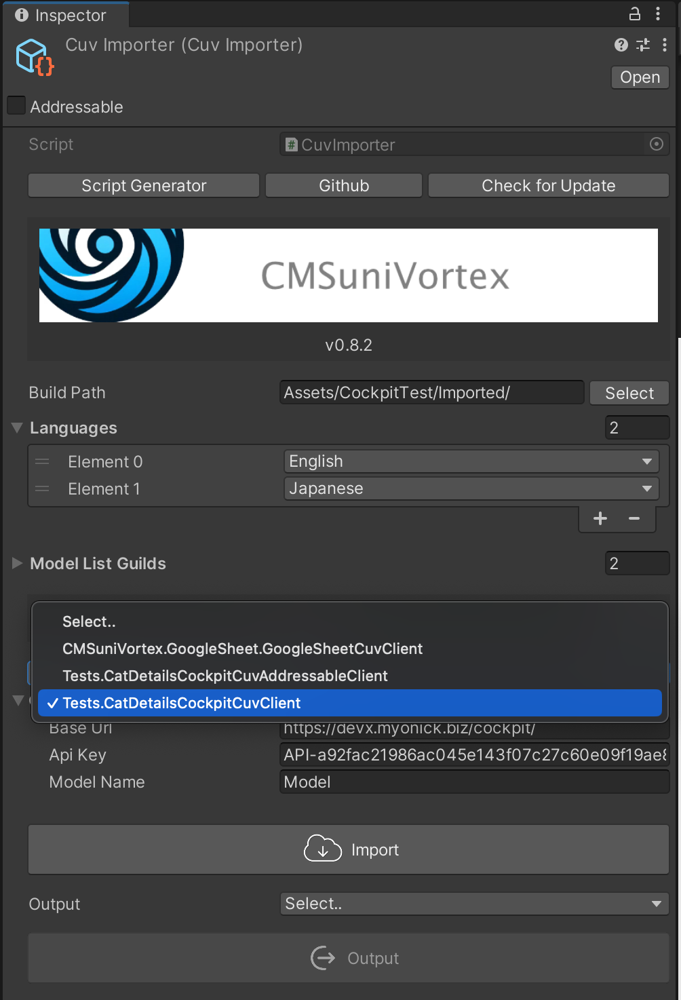
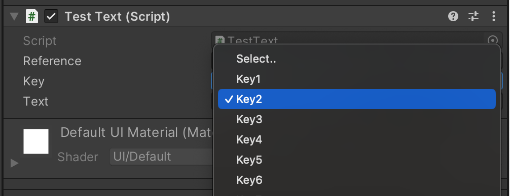
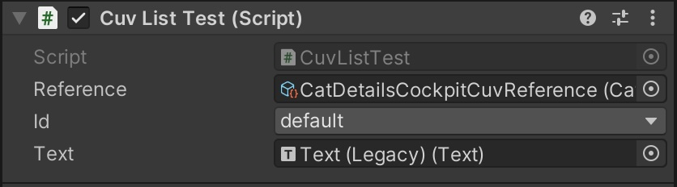

## 各クラスの役割

### [CuvImporter](https://github.com/IShix-g/CMSuniVortex/blob/main/Packages/CMSuniVortex/Runtime/CuvImporter.cs)

CMSからのインポートの管理。必要な状態を保存する

#### 保存している内容

- ビルド先のパス
- 対象言語 (配列)
- 現在使用中の`CuvClient`



### [CuvClient](https://github.com/IShix-g/CMSuniVortex/blob/main/Packages/CMSuniVortex/Runtime/CuvClient.cs)

どのCMSを使い、どのモデルを利用するかを決定する。実装すると`CuvImporter`のプルダウンに表示される。

#### CMSの種類

- Cockpit CMS
- Google Sheets

#### ファイルの参照方法

- 直接参照
- [Addressables](https://docs.unity3d.com/Packages/com.unity.addressables@1.19/manual/index.html)からの参照

### CuvClientで使えるAttribute

#### `[IgnoreImporter]`アトリビュート
指定すると`CuvImporter`のプルダウンから除外され表示されません。

```csharp
[IgnoreImporter] // <--
public sealed class TestCockpitCuvClient : CockpitCuvClient<TestCockpitModel, TestCockpitCuvModelList>
{
    protected override JsonConverter<TestCockpitModel> CreateConverter()
        => new CuvModelConverter<TestCockpitModel>();
}

```

#### `[CuvDisplayName("Name")]`アトリビュート
指定すると`CuvImporter`のプルダウンに表示される名称を変更できます。

```csharp
[CuvDisplayName("YourCustomName")] // <--
public sealed class TestCockpitCuvClient : CockpitCuvClient<TestCockpitModel, TestCockpitCuvModelList>
{
    protected override JsonConverter<TestCockpitModel> CreateConverter()
        => new CuvModelConverter<TestCockpitModel>();
}

```

### [CuvModelList](https://github.com/IShix-g/CMSuniVortex/blob/main/Packages/CMSuniVortex/Runtime/CuvModelList.cs)

`CuvClient`によって生成される。データを対象言語別に`ScriptableObject`に保存する。モデルが配列で格納され`Key`で取得できる。

### [ICuvModel](https://github.com/IShix-g/CMSuniVortex/blob/main/Packages/CMSuniVortex/Runtime/ICuvModel.cs)

モデル。CMSの1記事に相当するデータ。

### [ICuvOutput](https://github.com/IShix-g/CMSuniVortex/blob/main/Packages/CMSuniVortex/Runtime/ICuvOutput.cs)

`CuvModelList`をどのようにして参照するか決定し、`CuvReference`を生成する。実装すると`CuvImporter`のプルダウンに表示される。

#### 種類

- 直接参照
- [Addressables](https://docs.unity3d.com/Packages/com.unity.addressables@1.19/manual/index.html)からの参照

### [CuvReference](https://github.com/IShix-g/CMSuniVortex/blob/main/Packages/CMSuniVortex/Runtime/CuvReference.cs)

言語別に格納された`CuvModelList<T>`の参照を管理する`ScriptableObject`。利用側は、ここから取得する。

## Compornent

### `CuvModelKey("ref")` アトリビュート

生成した`CuvReference`を直接参照して使用しても良いですが、このコンポーネントを使うと設定した`Key`一覧をプルダウンで表示してくれるので便利です。




引数に参照したい`CuvReference`のフィールド名を渡します。

```csharp
public abstract class Test : MonoBehaviour
{
    [SerializeField] GoogleSheetCuvReference _reference;
    [SerializeField, CuvModelKey("_reference")] string _key;

```

### CuvLocalized

`CuvModelKey`アトリビュートをラップして使いやすくしたローカライズ用のクラスです。

```csharp
using CMSuniVortex;
using CMSuniVortex.GoogleSheet;
using UnityEngine;
using UnityEngine.UI;

public sealed class TestText : CuvLocalized<GoogleSheetCuvReference>
{
    [SerializeField] Text _text;

    protected override void OnChangeLanguage(GoogleSheetCuvReference reference, string key)
    {
        if (reference.TryGetByKey(key, out var model))
        {
            _text.text = model.Text;
        }
    }
}
```

### CuvAddressableLocalized

`CuvLocalized`の非同期版です。

```csharp
using CMSuniVortex;
using CMSuniVortex.GoogleSheet;
using UnityEngine;
using UnityEngine.UI;

public sealed class TestText : CuvAddressableLocalized<GoogleSheetCuvReference>
{
    [SerializeField] Text _text;

    protected override void OnChangeLanguage(GoogleSheetCuvReference reference, string key)
    {
        if (reference.TryGetByKey(key, out var model))
        {
            _text.text = model.Text;
        }
    }
}
```

### SetParam

`{}`で囲う事でパラメーターを埋め込む事ができます。

- 文言 `You have earned {number} coins.`
- 表示 `You have earned 5 coins.`

```csharp
var text = model.Text.SetParam("number", 5);
```

### CuvList

ローカライズではない場合、`CuvList`コンポーネントが使えます。
これを使う事でListのIDをInspector指定できます。

```csharp
using UnityEngine;
using UnityEngine.UI;
using CMSuniVortex;
using Tests;

public class CuvListTest : CuvList<CatDetails, CatDetailsCockpitCuvReference>
{
    [SerializeField] Text _text;
    
    void Start()
    {
        Debug.Log("CuvId: " + List.CuvId);
        _text.text = List.CuvId;
    }
}
```



### CuvModel

`CuvList`の機能に、更にKeyを指定できるようになります。

```csharp

using UnityEngine;
using UnityEngine.UI;
using CMSuniVortex;
using Tests;

    public sealed class CuvModelTest : CuvModel<CatDetails, CatDetailsCockpitCuvReference>
    {
        [SerializeField] Text _text;
        [SerializeField] Image _image;

        void Start()
        {
            Debug.Log("ModelId: " + Model.Key);
            _text.text = Model.Text;
            _image.sprite = Model.Image;
        }
    }
```


### CuvLanguages

現在使用可能な言語一覧と現在の言語を取得できます。下記は、DropDownの実装例です。

```csharp

using System.Collections.Generic;
using UnityEngine;
using UnityEngine.UI;

namespace CMSuniVortex
{
    public sealed class CuvLanguageDropDown : CuvLanguages
    {
        [SerializeField] Dropdown _dropdown;

        protected override void OnInitialized()
        {
            var options = new List<Dropdown.OptionData>();
            foreach (var language in Languages)
            {
                var languageString = language.ToString();
                var data = new Dropdown.OptionData(languageString);
                options.Add(data);
            }
            _dropdown.options = options;
            _dropdown.value = GetLanguageIndex(ActiveLanguage);
            _dropdown.onValueChanged.AddListener(OnValueChanged);
        }

        void OnValueChanged(int index)
        {
            var language = GetLanguageAt(index);
            ChangeLanguage(language);
        }

        void Reset() => _dropdown = GetComponent<Dropdown>();
    }
}
```

ゲーム中に下記のような言語選択の画面を表示できます。


### CuvLanguageSwitcher

言語の一覧、現在の言語などを保持する大元のクラス。`CuvLanguages`はこのクラスをラップしたクラスです。

### CuvLanguageSettings

言語の設定。詳しくは、[コチラ](Localization_jp.md)をごらんください。

`Window > CMSuniVortex > open Language Setting`

